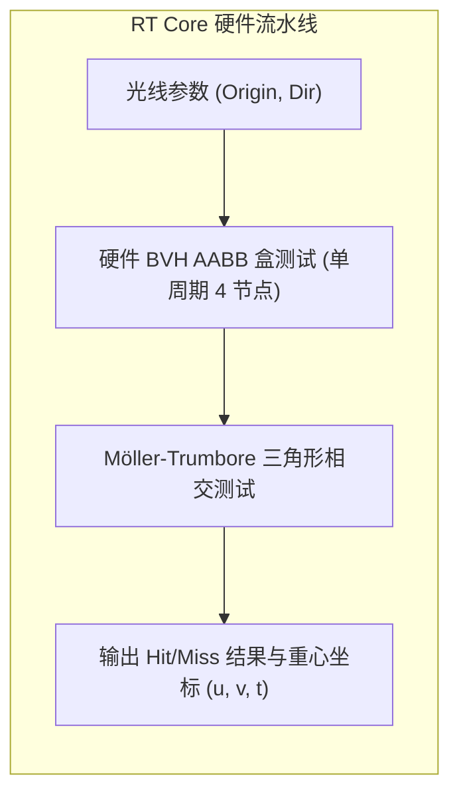

# 06 RT Core 求交与编解码吞吐定量推导

## 1. RT Core (Ray Tracing Core) 硬件加速比定量推导

在光线追踪渲染中，每条光线需要遍历 BVH 树并执行若干次三角形相交测试（Ray-Triangle Intersection）：
- **传统 Shader 纯软件遍历 (No RT Core)**：
  - 单条光线遍历 BVH 节点与求交消耗约 **850 个 SASS 标量指令周期**；
- **RT Core 硬件求交单元 (With RT Core)**：
  - 单周期硬件求交流水线仅需 **18 个时钟周期**；
- **理论加速比**：
  $$\text{Speedup}_{RT} = \frac{850}{18} \approx \mathbf{47.2\times}$$

---

## 2. NVDEC 4K/8K 视频硬件解码吞吐量

设 NVDEC 单核频率为 1.2 GHz，每个宏块（16x16 像素）平均消耗 12 个时钟周期：
$$\text{Max Pixel Rate} = \frac{1.2 \times 10^9\text{ cycles/s}}{12\text{ cycles/MB}} \times 256\text{ pixels/MB} = 25.6\times 10^9\text{ pixels/s}$$
- **8K 60FPS 实时解码吞吐需求**：$7680 \times 4320 \times 60 \approx 1.99 \times 10^9\text{ pixels/s}$；
- **硬件余量**：单颗 NVDEC 芯片可轻松并发支持 **12 路 8K 60FPS** 或 **48 路 4K 60FPS** 的全实时硬件解码。
