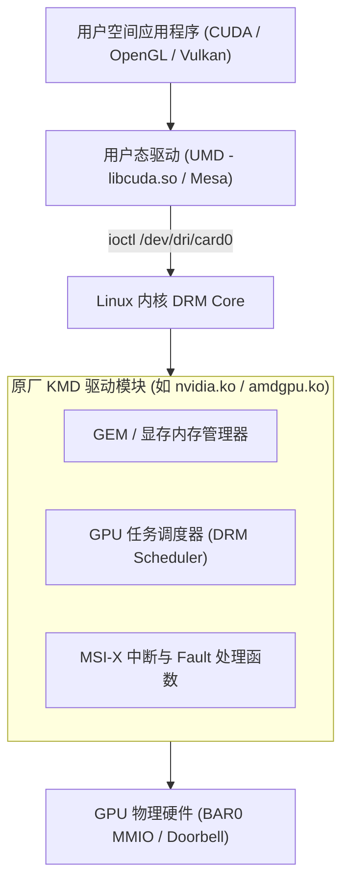

# 01 Linux KMD 内核驱动与 DRM / KMS 架构

## 1. Linux DRM (Direct Rendering Manager) 架构

Linux 内核中的 GPU 驱动标准子系统采用 DRM 架构，主要由两大部分构成：
- **KMS (Kernel Mode Setting)**：负责管理显示输出接口（CRTC、Encoder、Connector、Plane）和屏幕分辨率设置。
- **GEM (Graphics Execution Manager) / TTM**：负责管理 GPU 物理显存与系统内存页面的分配、回收与跨进程共享（dma-buf）。

