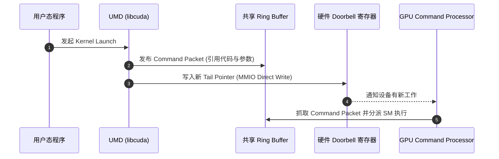

# 02 UMD 用户态驱动与 Ring Buffer 异步提交

## 1. API、驱动实现与硬件协议不是同一层

一次 kernel launch 返回，不表示 GPU 已执行完毕。运行时处理参数、依赖和模块加载，驱动将请求转换成设备命令；命令通常引用已上传的代码和参数，不能等同于完整 SASS 指令流。

Linux DRM 驱动可以通过 ioctl 接收任务；部分设备与驱动支持受管理的用户态队列。是否允许直接写 Doorbell，取决于硬件、驱动版本、权限和队列类型。不能将“零系统调用、低于 500ns”作为所有 GPU 的承诺，也不能把某个 DRM 驱动的协议直接套到 CUDA。

以下仅为支持用户态队列的教学路径：初始化时建立受保护的上下文、地址空间和队列，UMD 按目标 ABI 发布命令，再通知硬件。CPU 虚拟地址、GPU 虚拟地址和物理地址必须区分，具体 buffer 与同步对象可参考 [DRM Memory Management](https://docs.kernel.org/gpu/drm-mm.html)。

## 2. 发布、完成与释放的契约

| 阶段 | 必要条件 | 应保存的证据 |
| --- | --- | --- |
| 准备输入 | buffer 有效、设备可访问、生产者已完成 | 大小、映射方式、依赖事件 |
| 编码命令 | 参数布局、grid/block、共享内存满足目标 ABI | kernel 标识与 launch 配置 |
| 发布工作 | 描述符、生产者索引、MMIO 按平台协议排序 | 队列序号、提交时间 |
| 调度执行 | 依赖满足，执行资源可用 | 开始时间、等待原因 |
| 完成通知 | 覆盖约定的执行及可见性范围 | 成功/错误状态、event/fence |
| 回收资源 | 最后消费者不再引用 buffer、映射和代码 | 最后使用事件、引用计数 |

Doorbell 是通知，不证明数据已经对 GPU 可见。普通 C/C++ `volatile` 也不能代替 DMA 同步和 MMIO ordering；发布屏障及映射规则以目标平台 ABI 为准。

## 3. 三种时间分别测量

CPU API 时间可能包含初始化和 JIT，也可能只覆盖排队。设备执行时间覆盖 kernel 起止；端到端时间还包括搬运、等待和结果消费。不能用 CPU launch 时间计算 kernel TFLOP/s，也不能直接相减 CPU/GPU 两个未校准时钟的原始值。

区分冷启动与稳态，warm-up 后重复采样，保存并发度、输入和失败记录。跨时钟关联使用 profiler 的校准能力。

## 4. 多 Stream 的依赖与生命周期

同一 stream 有序提交可以表达流水依赖；跨 stream 消费则需要显式建立适当同步。例如 S0 产生 B 后记录事件 E，S1 等待 E 再消费 B。Host 看到 launch 返回就重写输入，或仅因另一个 stream 已完成就释放 B，都不能证明安全。

异步复制能否重叠还依赖内存类型、硬件能力和 stream 语义。多 stream 不等于多份带宽。具体语义应查目标版本的 [CUDA Programming Guide](https://docs.nvidia.com/cuda/cuda-c-programming-guide/)，不能从一次时间线反推通用 API 保证。

## 5. 超时、复位与旧完成事件

教学状态模型是 `NEW → QUEUED → RUNNING → SUCCESS / ERROR / CANCELLED`。超时可能来自依赖、地址错误、调度饥饿或通知丢失，不自动等于硬件死锁。

复位前停止新提交、隔离旧任务，再处理失败通知与资源回收。复用队列槽需要区分旧任务的序号/代际，防止迟到完成误唤醒新任务。应用按运行时要求重建失效上下文，不能假设旧设备指针仍然有效。

自测：API 返回快为什么业务 P99 高？双 stream 为什么才出现 mismatch？为什么没有 ioctl 的一次采样不能证明所有提交都零系统调用？继续阅读 [GEMM 性能证据链](../Case-Studies/04-gemm-evidence-path.md)。
