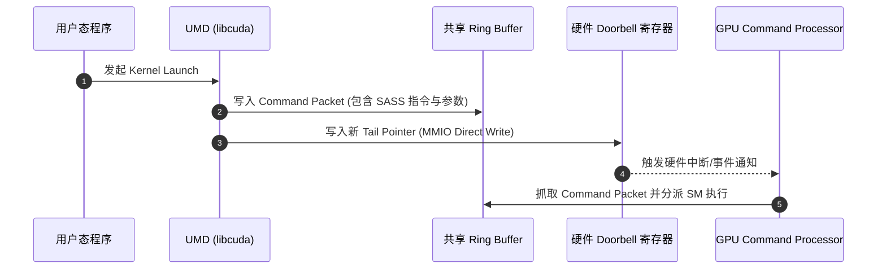

# 02 UMD 用户态驱动与 Ring Buffer 异步提交

## 1. 零系统调用（Zero-Syscall）快速提交路径

为了降低任务提交的延迟，现代高性能 GPU 驱动采用了**用户态直通提交架构**：
1. **初始化阶段**：KMD 在系统启动时分配一块 Host-Device 共享的循环队列（Ring Buffer），并将其虚拟地址直接 `mmap` 映射至用户态进程空间；同时将硬件 Doorbell 寄存器映射到用户空间。
2. **任务发射阶段**：UMD 在用户态直接向 Ring Buffer 写入 GPU 机器指令与参数描述符，随后直接写入 Doorbell 寄存器。**整个任务下发过程 0 次系统调用，延迟 < 500ns**。

