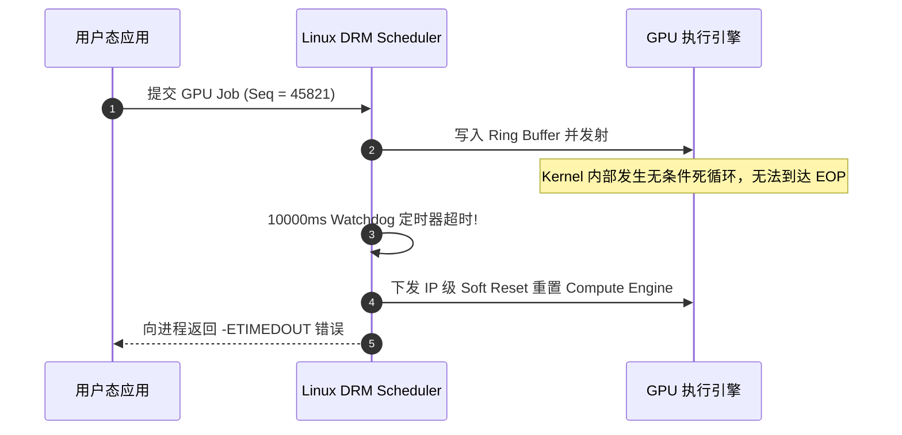

# 05 驱动 Fence 超时与 Kernel Panic 故障诊断

## 案例 1：DRM Scheduler Fence 超时触发 GPU 软复位

### 1. 现场故障日志
```text
[ 142.890123] [drm:drm_sched_job_timedout] *ERROR* ring compute_0 timeout, signaled seq=45820, emitted seq=45821
[ 142.890150] [drm] GPU Reset initiated on device 0000:01:00.0
[ 142.920400] [drm] GPU soft reset succeeded, restarting guilty job entity
```



### 2. 根因剖析与隔离机制
- **根因**：用户下发的 CUDA Kernel 中存在无条件自旋锁（Spinlock），等待某未初始化的共享内存标志位，导致 GPU 硬件无法产生 EOP（End-of-Pipe）Fence 信号。
- **处理**：DRM 调度器捕获超时后，触发 GPU 引擎软复位（Soft Reset），仅销毁违规进程上下文，保护整个操作系统不崩溃。
