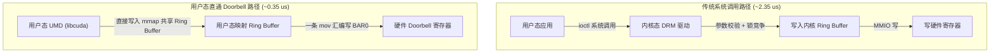

# 06 UMD 零系统调用提交延迟定量计算

## 1. 传统系统调用路径 vs 用户态直通提交路径

### 2. 详细耗时拆解与定量推导

| 执行阶段 | 传统 ioctl 提交耗时 | UMD 用户态 Doorbell 提交耗时 | 性能提升幅度 |
| :--- | :--- | :--- | :--- |
| **Command Packet 组包** | 100 ns | 100 ns | 相同 |
| **用户/内核上下文切换** | 850 ns (Trap, 寄存器保存恢复) | **0 ns (无系统调用)** | **$\infty$** |
| **内核互斥锁与参数校验** | 1150 ns (VMA 校验与 Mutex) | **0 ns** | **$\infty$** |
| **MMIO 触发 (PCIe Write)**| 250 ns | 250 ns (用户态直写 BAR0) | 相同 |
| **单次任务下发总时延** | **2350 ns (2.35 $\mu$s)** | **350 ns (0.35 $\mu$s)** | **快 6.7 倍** |
