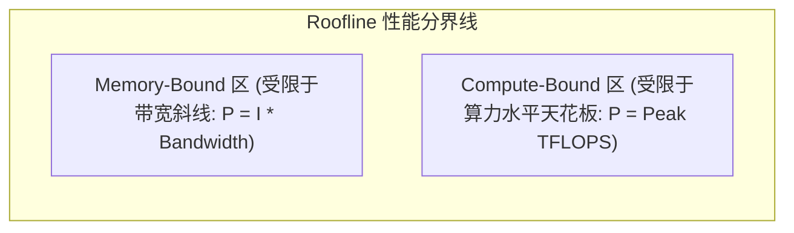

# 01 Roofline 模型与算术强度分析

## 1. Roofline 模型理论与公式

Roofline 模型是评估 GPU 算子性能上限的核心工具：
$$\text{算术强度 (Operational Intensity, } I\text{)} = \frac{\text{总浮点运算量 (FLOPs)}}{\text{总显存访问量 (Bytes)}}$$

$$\text{可达峰值性能 } P = \min\left(P_{peak\_compute},\; I \times B_{peak\_memory}\right)$$

- **Memory-Bound 算子**：Softmax、LayerNorm、Elementwise Add。优化策略：算子融合（Operator Fusion）、减少中间写回显存。
- **Compute-Bound 算子**：大尺寸 GEMM、密集卷积。优化策略：提高 Tensor Core 吞吐、优化寄存器复用。
