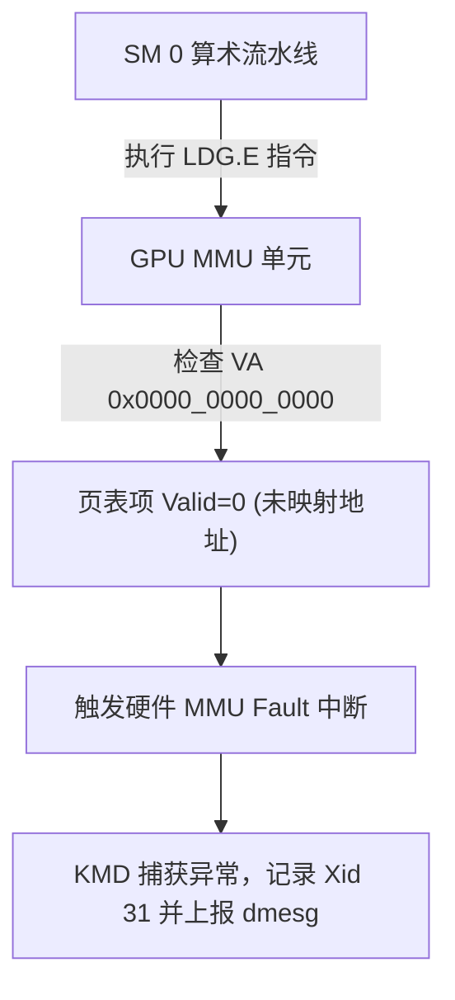

# 05 GPU 故障诊断 Xid 报错定位实战

## 案例 1：Xid 31 MMU Page Fault 精确定位非法指针访问

### 1. 现场日志与错误剖析
```text
NVRM: Xid (PCI:0000:01:00): 31, pid=14092, name=llama_infer, Channel: 0x0000001f, 
      GPU MMU Page Fault: VA 0x000000000000 at subid 0x2, GPC 0x3, TPC 0x1, SM 0x0
```



### 2. 精准定位与修复步骤
1. 错误地址为 `VA 0x000000000000`，说明是经典的**空指针解引用**；
2. 使用 `compute-sanitizer --tool memcheck ./llama_infer` 运行，精确打印出产生空指针读操作的行号（`attention_kernel.cu:142`），修复指针传递后故障消除。
