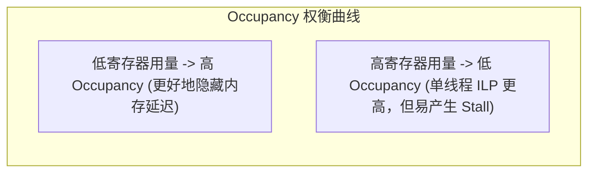

# 06 采样与 Warp Occupancy 理论建模

## 1. SM 活跃 Warp 数量理论数学模型

$$\text{Active Warps} = \min\left(W_{max\_SM},\; \lfloor \frac{R_{SM}}{R_{thread} \times 32} \rfloor,\; \lfloor \frac{S_{SM}}{S_{block}} \rfloor \times W_{block}\right)$$

### 实例定量计算（以典型 SM 规格为例）：
- **硬件上限**：$W_{max\_SM} = 64$ Warps，寄存器总数 $R_{SM} = 65536$，Shared Memory $S_{SM} = 228\text{ KB}$；
- **配置 A**：单线程使用 32 个寄存器，Block 占用 48KB Shared Memory（包含 8 个 Warp）：
  - 寄存器限制：$\lfloor \frac{65536}{32 \times 32} \rfloor = 64$ Warps；
  - 共享内存限制：$\lfloor \frac{228}{48} \rfloor \times 8 = 4 \times 8 = 32$ Warps；
  - **最终活跃 Warp 数**：$\min(64, 64, 32) = 32$ Warps（Occupancy = **50%**）。

