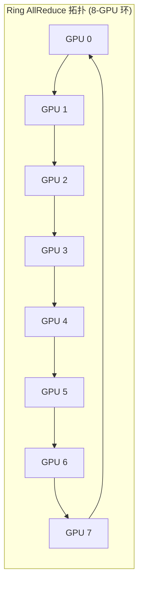

# 01 NCCL 集合通信与底层拓扑算法

## 1. NCCL 通信算法：Ring vs Tree

- **Ring 环形算法**：
  - 数据切分为 $N$ 份分片，在逻辑环上循环传递 $2(N-1)$ 步。
  - **总传输数据量**：$2 \times \frac{N-1}{N} \times \text{DataSize}$，带宽利用率高，极其适合**大数据块通信（Large Buffer > 4MB）**。
- **Tree 树形算法 (Double Binary Tree)**：
  - 构建双二叉树结构，通信跳数仅为 $2 \times \log_2(N)$。
  - 极其适合**小数据块低延迟通信（Small Buffer < 512KB）**。

