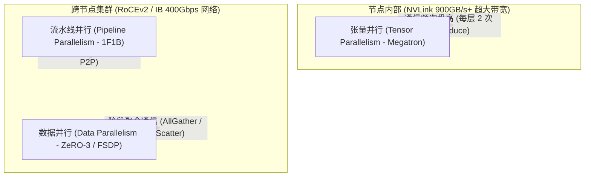

# 02 3D 并行 (TP/PP/DP) 硬件映射与通信开销

## 1. 大模型 3D 并行与硬件拓扑最佳映射

```mermaid
graph TD
    subgraph IntraNode["节点内部 (NVLink 900GB/s+ 超大带宽)"]
        TP["张量并行 (Tensor Parallelism - Megatron)"]
    end

    subgraph InterNode["跨节点集群 (RoCEv2 / IB 400Gbps 网络)"]
        PP["流水线并行 (Pipeline Parallelism - 1F1B)"]
        DP["数据并行 (Data Parallelism - ZeRO-3 / FSDP)"]
    end
    
    TP -. 通信频次极高 (每层 2 次 AllReduce) .-> IntraNode
    PP -. 通信频次低 (仅阶段边界 P2P) .-> InterNode
    DP -. 阶段聚合通信 (AllGather / ReduceScatter) .-> InterNode
```
