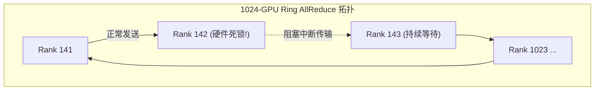

# 05 集群 NCCL Watchdog Timeout 卡死定位实战

## 案例 1：Rank 142 硬件 Hang 导致 1024 卡大模型训练假死

### 1. 现场故障现象
训练日志停止刷新 20 分钟后，所有 Worker 节点集体报错：
```text
Watchdog caught collective operation timeout: NCCL operation failure on rank 142
[NCCL_DEBUG] rank 142 failed to send ring packet to rank 143 after 1200000ms
```



### 2. 诊断排查链
1. 开启环境变量：`export NCCL_DEBUG=INFO NCCL_DEBUG_SUBSYS=ALL`；
2. 抓取日志中最后一个发出 `RING_SEND` 但未被确认的 Rank 编号；
3. 定位到 Node 18 Rank 142 由于板载 PCIe 插槽掉速卡死在 Kernel Launch，导致 Ring 环路通信彻底中断；
4. 调度器剔除该物理节点并从 Checkpoint 自动恢复训练。
