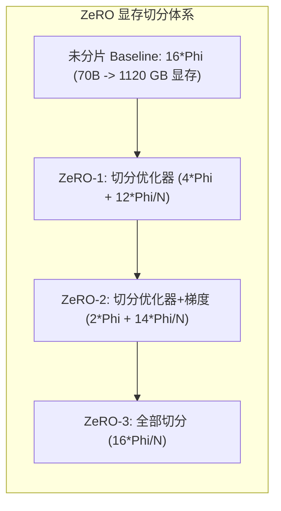
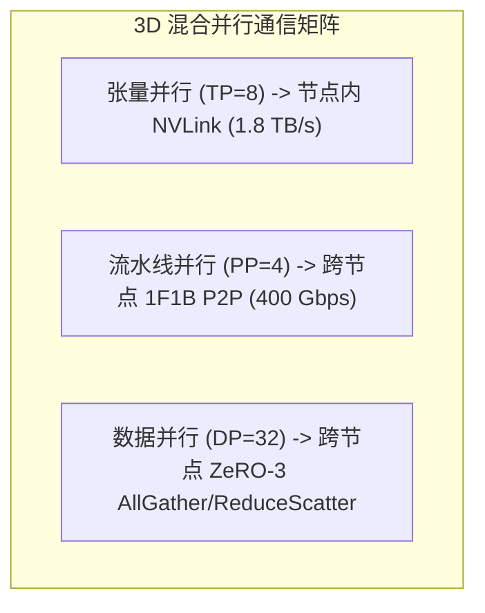

# 06 大模型 3D 并行显存占用与通信量推导

## 1. 模型参数与训练状态显存占用精确公式 (ZeRO 体系)

在大语言模型（LLM）分布式训练中，单卡显存消耗由四个部分组成：
$$M_{total} = M_{weights} + M_{gradients} + M_{optimizer} + M_{activations}$$

### 1. 静态参数与优化器状态 (以 16-bit 混合精度 + Adam 优化器为例)
对于参数量为 $\Phi$（如 70B = $70 \times 10^9$）的模型：
- **模型参数 (Weights)**：$2\Phi$ Bytes (FP16/BF16)；
- **梯度 (Gradients)**：$2\Phi$ Bytes (FP16/BF16)；
- **Adam 优化器状态 (Optimizer States)**：$12\Phi$ Bytes，包含：
  - FP32 Master Weights: $4\Phi$ Bytes；
  - FP32 一阶动量 (Momentum): $4\Phi$ Bytes；
  - FP32 二阶动量 (Variance): $4\Phi$ Bytes；
- **静态总容量**：$M_{static} = 2\Phi + 2\Phi + 12\Phi = 16\Phi\text{ Bytes}$（即每 1B 参数需 16 GB 显存）。

---

## 2. 3D 并行各维度的通信量与拓扑映射

### 通信量定量推导表 (每 Iteration 每卡通信量)

| 并行模式 | 典型切分度 | 集合通信原语 | 单步通信数据量 (Bytes) | 推荐承载网络 |
| :--- | :--- | :--- | :--- | :--- |
| **张量并行 (TP)** | 8 (节点内) | AllReduce (每层前向 1 次 + 反向 1 次) | $2 \times 2 \times \frac{\text{TP}-1}{\text{TP}} \times (b \cdot s \cdot h) \times L$ | **NVLink4/5 (900GB/s+)** |
| **流水线并行 (PP)** | 4~8 (跨节点) | Point-to-Point P2P (阶段边界传递激活) | $2 \times (b \cdot s \cdot h)$ per micro-batch | **RoCEv2 / IB (400Gbps)** |
| **数据并行 (DP / ZeRO-3)** | 32~256 | AllGather (前向/反向取权重) + ReduceScatter (梯度聚合) | $2 \times 2\Phi \times \frac{\text{DP}-1}{\text{DP}}$ | **RoCEv2 / IB (400Gbps)** |
