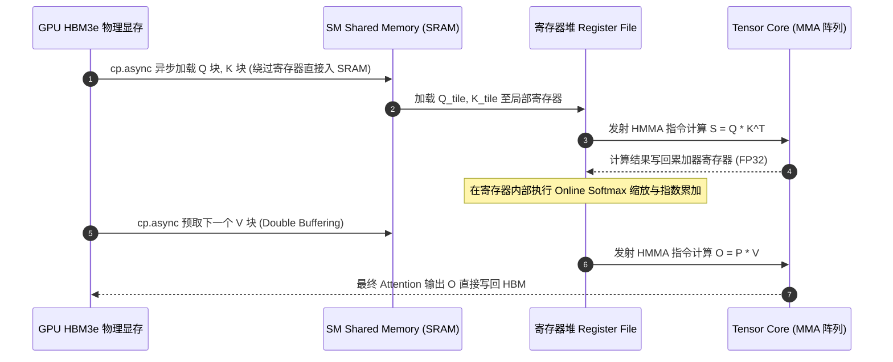

# 01 FlashAttention 在 SM 内部的硬件执行路径推演

## 1. 核心推演目标

FlashAttention 通过分块（Tiling）与在线 Softmax 算法，将传统的 $O(N^2)$ 显存读写降至 $O(N)$。

```mermaid
sequenceDiagram
    autonumber
    participant HBM as GPU HBM3e 物理显存
    participant SRAM as SM Shared Memory (SRAM)
    participant RF as 寄存器堆 Register File
    participant TC as Tensor Core (MMA 阵列)

    HBM->>SRAM: cp.async 异步加载 Q 块, K 块 (绕过寄存器直接入 SRAM)
    SRAM->>RF: 加载 Q_tile, K_tile 至局部寄存器
    RF->>TC: 发射 HMMA 指令计算 S = Q * K^T
    TC-->>RF: 计算结果写回累加器寄存器 (FP32)
    Note over RF: 在寄存器内部执行 Online Softmax 缩放与指数累加
    HBM->>SRAM: cp.async 预取下一个 V 块 (Double Buffering)
    RF->>TC: 发射 HMMA 指令计算 O = P * V
    TC-->>HBM: 最终 Attention 输出 O 直接写回 HBM
```
