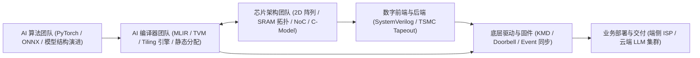

# 00 总览与设计哲学（原厂视角）

## 原厂研发分工与 DSA 设计哲学

领域专用架构（Domain-Specific Architecture, DSA）的核心设计原则是**“牺牲通用标量灵活性，换取极限能效比与算力密度”**。在 NPU 芯片原厂中，芯片与软件的协同度远超通用 CPU/GPU：



---

## 三条原厂核心学习路线

### 路线 1：AI 编译器、图优化与算子切分线（Compiler & Graph Track）
- **核心目标**：编写图优化 Pass、算子融合、多级 Tiling 算法与 SRAM 静态内存复用，生成高 MFU 指令流。
- **推荐路径**：
  ```text
  01 NPU 总体架构 → 02 脉动阵列与 VPU → 03 片上 SRAM 与双缓冲
  → 04 混合精度与量化 → 09 AI 编译器与 Tiling → 10 MFU 性能分析
  → Case-Studies 01 Transformer 映射 → Labs 02 TVM Tiling
  ```

### 路线 2：底层驱动、微控制器固件与任务调度线（Driver & Firmware Track）
- **核心目标**：掌握 Linux KMD、Task Queue 硬件队列、Hardware Barrier 同步与多核中断处理。
- **推荐路径**：
  ```text
  01 NPU 总体架构 → 03 Scratchpad SRAM → 05 Tensor DMA
  → 07 VLIW 指令流与调度器 → 09 驱动与运行时 → 10 故障定位
  → Case-Studies 03 相机 ISP-NPU 流水
  ```

### 路线 3：芯片微架构、数字设计与集群互联线（Silicon & Interconnect Track）
- **核心目标**：掌握 2D 脉动阵列微架构、Tensor DMA 地址生成器、2D Mesh NoC 与云端 Chip-to-Chip 扩展。
- **推荐路径**：
  ```text
  01 DSA 芯片定义 → 02 脉动阵列数据通路 → 05 Tensor DMA
  → 06 片上 NoC 互联 → 08 端云分化 → 11 集群互联与 HCCL
  → Cross-Topics 01~04
  ```
