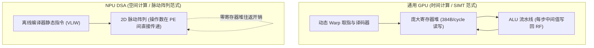

# 01 DSA 专用领域架构设计哲学与 PPA

## 1. 为什么深度学习需要专用领域架构 (DSA)

在深度学习工作负载中，95% 以上的计算时间消耗在高度规则的多维张量运算（GEMM 矩阵乘法、2D/3D 卷积）上。通用 CPU/GPU 在硬件指令译码、乱序调度与分支预测上浪费了大量面积与功耗：

---

## 2. NPU DSA 设计的三大法则

1. **2D 脉动阵列空间计算**：将数百上千个 MAC 乘加单元在二维平面互联，数据在相邻 PE 之间如血液般脉动传递，操作数复用率达到 $O(N)$，消除 90% 的片上寄存器读写功耗。
2. **软件显式管理的 Scratchpad SRAM (SPM)**：完全摒弃带有 Tag 命中比对与随机淘汰的透明硬件 Cache，由 AI 编译器在离线期精确排布每一块张量的存放生命周期与物理偏移。
3. **极致的算力能效比（TOPS/W）**：在相同工艺节点下，DSA NPU 的推理能效比可达通用 GPU 的 **3~8 倍**。
