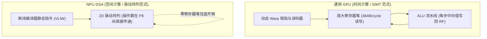

# 01 DSA 专用领域架构设计哲学与 PPA

## 1. 为什么深度学习需要专用领域架构 (DSA)

如果目标模型的 Profiling 显示 95% 以上的计算时间用于规则张量运算（GEMM、2D/3D 卷积），就值得分析专用计算阵列与数据复用的收益。通用 CPU/GPU 的调度、指令处理和存储结构服务于更广泛的负载；DSA 则围绕目标运算调整这些资源。下图比较两种执行结构：

```mermaid
graph TB
    subgraph GPU_Temporal["通用 GPU (时间计算 / SIMT 范式)"]
        Dec_GPU["动态 Warp 取指与译码器"] --> RF_GPU["庞大寄存器堆 (384B/cycle 读写)"]
        RF_GPU --> ALU_GPU["ALU 流水线 (每步中间值写回 RF)"]
        ALU_GPU --> RF_GPU
    end

    subgraph NPU_Spatial["NPU DSA (空间计算 / 脉动阵列范式)"]
        Inst_NPU["离线编译器静态指令 (VLIW)"] --> SA_NPU["2D 脉动阵列 (操作数在 PE 间直接传递)"]
        SA_NPU -. 零寄存器堆往返开销 .-> SA_NPU
    end
```

---

## 2. NPU DSA 设计的三大法则

1. **2D 脉动阵列空间计算**：将 MAC 乘加单元在二维平面互联，操作数在相邻 PE 之间传递。在适合的映射下，复用次数可随阵列边长按 $O(N)$ 增长；若功耗估算以寄存器往返读写减少 90% 为参数，还需检查片上搬运、累加与控制开销，不能把该比例当作整芯片节电幅度。
2. **软件显式管理的 Scratchpad SRAM (SPM)**：由编译器安排张量生命周期与存储偏移，减少这部分存储对透明 Cache 的依赖。是否同时配置 Cache，取决于具体 NPU 的架构。
3. **算力能效比（TOPS/W）**：比较 NPU 与 GPU 时，需要注明模型、精度、稀疏口径、批大小、延迟要求和功耗测量边界。相同工艺节点并不足以确定两者的能效差距。可参照 [Google TPU 的原始评测论文](https://research.google/pubs/in-datacenter-performance-analysis-of-a-tensor-processing-unit/)查看如何记录设备代际、工作负载与比较对象。
