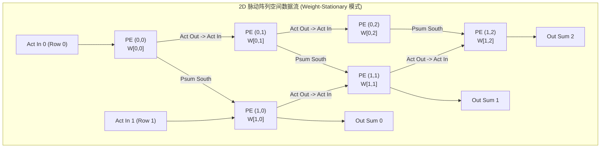

# 02 空间架构与数据流拓扑 (Spatial Architecture)

## 1. 空间计算 (Spatial Computing) 微架构拓扑

- **水平数据流（West $\rightarrow$ East）**：激活特征图沿行向东流动，每个时钟周期传递至下一个相邻 PE；
- **垂直数据流（North $\rightarrow$ South）**：部分和（Partial Sum）沿列向南累加流动，在底部流出最终矩阵乘结果。
