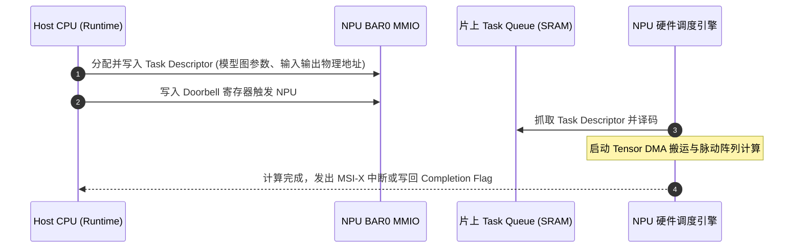

# 03 Host-Device 异构交互边界与 PCIe/AXI 接口

## 1. 异构系统接口拓扑

- **端侧 SoC NPU**：通过片上 AMBA AXI5 / NoC 总线直接挂载在主系统总线上，与 CPU/ISP 共享统一 LPDDR 物理内存。
- **云端 PCIe NPU**：作为 PCIe Gen5/Gen6 独立扩展卡插入服务器，拥有独立的板载 HBM3 / GDDR6 显存。

