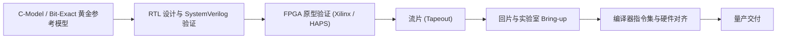

# 05 NPU 流片与 Bring-up 工程方法论

## 1. 芯片研发与 Bring-up 阶段划分

1. **Bit-Exact 黄金模型验证**：C-Model 必须做到时钟周期级与数值位精确（Bit-Exact），编译器生成的所有中间指令必须在 C-Model 上 100% 验证精度无误后方可下发硬件。
2. **Bring-up 首要步骤**：
   - 验证 AXI/PCIe 接口与寄存器读写；
   - 验证 Tensor DMA 单维/多维搬运；
   - 验证极简 16x16 矩阵乘法硬件计算结果。
