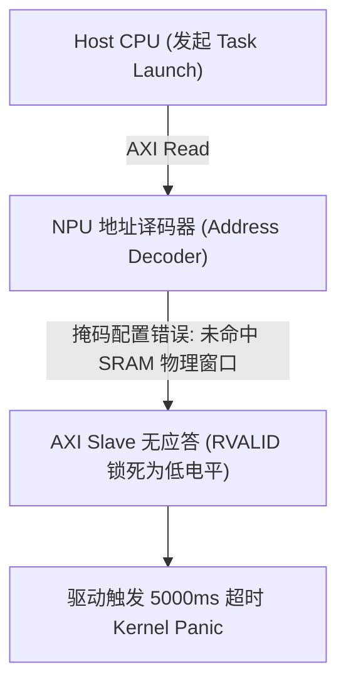

# 07 NPU Bring-up 故障与 Host 握手案例

## 案例 1：Host AXI 总线超时导致 NPU 启动挂死

### 1. 现场故障现象
在 FPGA 原型验证阶段，Host 发送第一个 Task Descriptor 后，NPU 驱动挂起在 `wait_for_completion_timeout`：
```text
[  12.304000] npu_core: ERROR: Command queue timeout on Task ID 0x0001
[  12.304020] npu_core: AXI bus state: RVALID stuck low, ARREADY high
```



### 2. 根因剖析与排查
- 片上 AXI Interconnect 的地址译码器中，SRAM 基地址掩码高 4 位配置错误，导致 NPU 抓取指令时向未映射地址发出读请求，AXI 从设备未回复 RVALID 导致握手死锁。修正 Address Decoder 掩码后正常取指。
