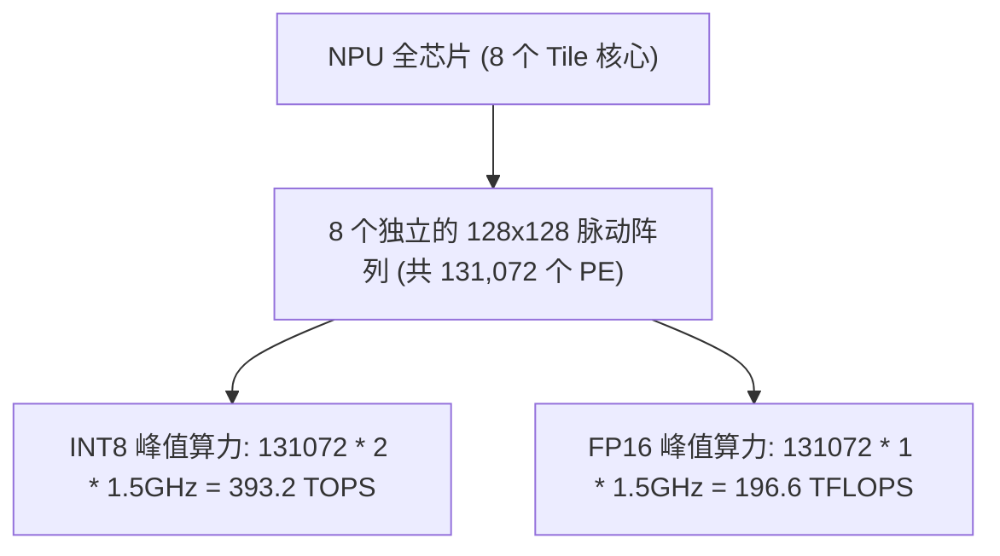

# 08 脉动阵列算力密度与 PPA 定量推演

## 1. NPU 峰值定点/浮点算力理论推导公式

NPU 芯片的核心算力由片上平铺的脉动阵列与向量计算单元共同提供：

$$\text{Peak TOPS (INT8)} = N_{Tile} \times 2 \times \text{Rows} \times \text{Cols} \times f_{clock}$$

### 实例定量推演：8-Tile 云端推理/训练 NPU 芯片
- **基础配置**：芯片集成 $N_{Tile} = 8$ 个同构 Tile 核心，工作频率 $f_{clock} = 1.5\text{ GHz}$；
- **单 Tile 脉动阵列规格**：$128 \times 128$ 2D INT8 PE 矩阵；
- **单 Tile 周期算力吞吐**：
  - 单 PE 每周期完成 1 次 $8\text{-bit} \times 8\text{-bit} + 32\text{-bit} \rightarrow 32\text{-bit}$ 乘累加（2 个 Ops）；
  - 单 Tile PE 总数：$128 \times 128 = 16,384\text{ PEs}$；
  - 单 Tile 峰值算力：$16,384 \times 2 \times 1.5\text{ GHz} = 49.152\text{ TOPS (INT8)}$；
- **全芯片理论峰值**：
  $$\text{Total Peak TOPS} = 8 \times 49.152\text{ TOPS} = \mathbf{393.216\text{ TOPS (INT8)}}$$
  - 若运行在 FP16 / BF16 模式（每个 PE 支持 1 次 16-bit 浮点乘加），全芯片峰值算力为 **196.608 TFLOPS**。

---

## 2. 7nm 工艺下芯片功耗与能效比 (PPA) 详细拆解

在 7nm FinFET 工艺、典型供电电压 $V_{dd} = 0.75\text{ V}$ 下，满载 393.2 TOPS 时的功耗拆解：

| 硬件子系统 | 功耗建模公式 | 典型功耗值 (W) | 功耗占比 (%) |
| :--- | :--- | :--- | :--- |
| **脉动阵列 MAC 逻辑** | $P_{MAC} = N_{PE} \cdot \alpha C V^2 f$ | 18.5 W | 52.8% |
| **片上 Scratchpad SRAM** | $P_{SRAM} = 8 \times (E_{read} + E_{write}) \cdot f$ | 9.2 W | 26.3% |
| **2D Mesh NoC 片上互联** | $P_{NoC} = N_{routers} \cdot E_{flit} \cdot \text{Throughput}$ | 3.8 W | 10.9% |
| **静态漏电功耗 (Leakage)** | $P_{leak} = V_{dd} \cdot I_{leak}(85^\circ\text{C})$ | 3.5 W | 10.0% |
| **全芯片整卡总功耗** | $P_{total}$ | **35.0 W** | **100.0%** |

### 算力能效比 (TOPS/W) 结论：
$$\text{Energy Efficiency} = \frac{393.216\text{ TOPS}}{35.0\text{ W}} = \mathbf{11.235\text{ TOPS/W}}$$
对比同工艺节点通用 GPU（典型能效比约 $1.8 \sim 2.5\text{ TOPS/W}$），专用 DSA 架构能效比提升 **4.5 ~ 6.2 倍**。
