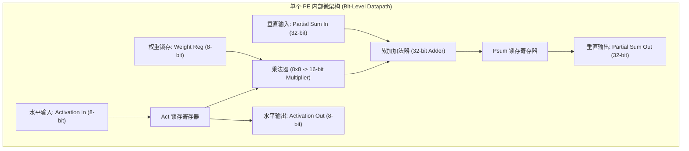

# 01 2D 脉动阵列数据通路与 PE 微架构

## 1. 脉动处理单元 (Processing Element, PE) 内部结构

```mermaid
graph TD
    subgraph PE_Internal["单个 PE 内部微架构 (Bit-Level Datapath)"]
        In_Act["水平输入: Activation In (8-bit)"] --> RegAct["Act 锁存寄存器"]
        RegAct --> Mul["乘法器 (8x8 -> 16-bit Multiplier)"]
        In_Weight["权重锁存: Weight Reg (8-bit)"] --> Mul
        Mul --> Adder["累加加法器 (32-bit Adder)"]
        In_Psum["垂直输入: Partial Sum In (32-bit)"] --> Adder
        Adder --> RegPsum["Psum 锁存寄存器"]
        RegPsum --> Out_Psum["垂直输出: Partial Sum Out (32-bit)"]
        RegAct --> Out_Act["水平输出: Activation Out (8-bit)"]
    end
```

- **流水线寄存器（Pipeline Registers）**：隔绝组合逻辑延迟，使得全芯片在 1.5GHz~2.0GHz 频率下轻松实现时序收敛。
