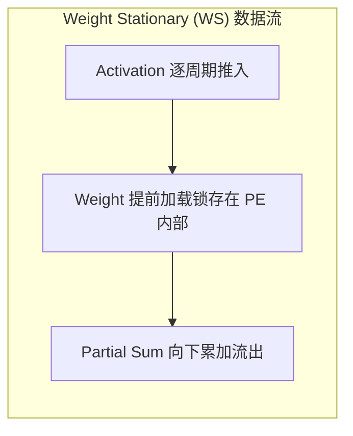

# 02 WS、OS 与 IS 三大数据复用模式深度对比

## 1. 三大数据复用流（Stationary Modes）对比

| 数据复用模式 | 驻留数据 (Stationary) | 水平流动数据 | 垂直流动数据 | 核心优势 | 最佳适用场景 |
| :--- | :--- | :--- | :--- | :--- | :--- |
| **Weight Stationary (WS)** | **权重 (Weight)** 固定在 PE 内部 | 激活 (Activation) 向东流动 | 部分和 (Partial Sum) 向南累加 | 权重访存功耗降至最低，能效极高 | 卷积网络 (CNN) 与 LLM 权重重用场景 |
| **Output Stationary (OS)** | **累加和 (Output Sum)** 固定在 PE 累加器 | 激活向东流动 | 权重向南流动 | 累加器位宽极大（如 32-bit），无部分和移动开销 | 大尺寸 GEMM 矩阵乘法 |
| **Input Stationary (IS)** | **激活输入 (Input)** 固定在 PE 内部 | 权重向东流动 | 部分和向南累加 | 激活数据极小且需多次复用 | Batch Size = 1 的轻载推理 |

