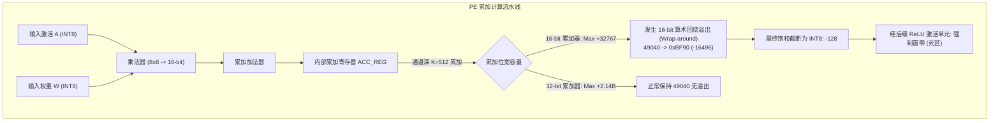
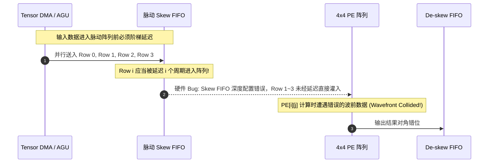
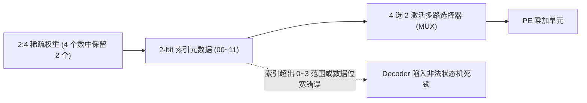

# 06 PE 阵列计算数值 Mismatch 与微架构调试实战

在 AI 芯片原厂的数字实现、FPGA 原型验证及 Silicon Bring-up 阶段，张量计算核心（Tensor Core / PE Array）常见的故障集中在**定点算术溢出截断**、**脉动数据推进时钟偏斜（Skew/De-skew）错位**以及**稀疏跳零单元硬件死锁**。

---

## 案例 1：脉动阵列内部累加器位宽截断导致特征图大面积归零

### 1. 现场故障现象与定位
在 ResNet-50 模型的第 3 阶段（Layer 3 Bottleneck）进行 INT8 推理时，输出特征图在多个通道出现异常的纯 0 斑块。通过抓取 NPU 物理执行结果与 CPU 黄金参考模型（Golden C-Model）进行逐元素（Bit-Exact）比对：

```text
[MISMATCH_LOG] Layer: conv3_2, Batch: 0, Channel: 128
  Coordinate [0, 128, 14, 14]:
    CPU Reference:   +245.200 (INT32 Accum: 49040 -> Dequant: 245.2)
    NPU Output:      -128.000 (Saturated min after ReLU -> 0.0)
    Delta:           -373.200
  Accumulator Reg Dump (Cycle 1420):
    PE[14][14] ACC_REG = 0x8030 (-32720, 16-bit 2's complement wrapped)
```



### 2. 根因分析与数学推演
- **累加动态范围极限计算**：
  在矩阵乘 $Y_{m,n} = \sum_{k=0}^{K-1} A_{m,k} \times W_{k,n}$ 中，设输入为均匀分布的饱和值（最大绝对值 127）：
  $$\text{Max\_Accum} = K \times (127 \times 127) \approx 16129 \times K$$
  当 Reduction 维度 $K > 2$ 时，单次累加和即可能突破 16-bit 有符号整数的最大上限（$+32767$）。本案例中通道数 $K = 512$，理论最大峰值累加和达 $8.25 \times 10^6$，需要至少 $\lceil \log_2(8.25 \times 10^6) \rceil + 1 = 24$ 位累加精度。
- **微架构缺陷**：
  早期 PE 微架构为了压缩面积，将 PE 本地 Accumulator 寄存器做成了 16-bit，仅依靠动态缩放来避免溢出。遇到通道数极大的卷积层时直接溢出回绕。

### 3. 原厂修复与工程规避
1. **RTL 级修复**：
   重构 PE 累加器流水线，将局部 Accumulator 扩展为 **32-bit INT32**（或 24-bit 扩展精度加法树），并保证在张量写回 Scratchpad 或经 Activation/Dequant 单元时才执行饱和缩放（Saturate Rounding）。
2. **编译器临时规避方案（Tape-out 前固化）**：
   在 AI 编译器端实施 **K-Slicing 拆分**：当 $K > 32$ 时，强制将 reduction 轴沿 $K$ 维度切分成多个 Sub-tiles（如 $K_{\text{sub}} = 32$），每次累加后将结果溢出写入片上 Buffer 进行部分和（Partial Sum）归约。

---

## 案例 2：脉动阵列 Skew / De-skew 时延对齐错误导致矩阵对角错位

### 1. 现场故障现象
在 2D 脉动阵列进行自研矩阵乘 Kernel 压测时，当输入为单位矩阵 $I$ 与任意矩阵 $B$ 相乘时，输出本应等于 $B$，但硬件输出矩阵出现明显的阶梯形对角移位与垃圾数据：

```text
Golden Expected Output:
  Row 0: [ 10,  20,  30,  40 ]
  Row 1: [ 15,  25,  35,  45 ]
  Row 2: [ 12,  22,  32,  42 ]
Actual Hardware Output:
  Row 0: [ 10,  20,  30,  40 ]  (Delay = 0 cycles)
  Row 1: [  0,  15,  25,  35 ]  (Delay = 1 cycle mismatch)
  Row 2: [  0,   0,  12,  22 ]  (Delay = 2 cycles mismatch)
```



### 2. 根因剖析
- 脉动阵列采用**波前推进（Wavefront Propagation）**机制：数据沿横向与纵向依次传递，第 $i$ 行激活在周期 $t_0 + i$ 到达第 0 列，第 $j$ 列权重在周期 $t_0 + j$ 到达第 0 行。
- 输入端必须经由 **Skew FIFO** 对输入数据添加步进时延（第 $i$ 行注入 $i$ 个周期的延时）。
- **根因**：编译器驱动下发的配置寄存器 `CFG_SKEW_EN` 生效延迟了 1 个时钟周期，且第一轮计算时 Skew FIFO 的初始读指针未复位为 0，导致首帧输入数据未经阶梯时延直接注入第一列，破坏了脉动波前的几何相位。

### 3. 规避与修复措施
- **硬件设计**：在脉动阵列入口硬件状态机中加入 `Skew_Lock` 握手信号，仅当所有输入行对应的 Shift-Register 均填入合法的阶梯时钟戳后，才拉高阵列全局使能 `ARRAY_RUN`。
- **验证断言**：在 UVM 仿真中加入 SVA（SystemVerilog Assertion）：
  ```systemverilog
  property check_systolic_wavefront;
      @(posedge clk) (in_valid[i] && !rst_n) |-> (##(i) pe_active[i][0]);
  endproperty
  ```

---

## 案例 3：2:4 结构化稀疏跳零单元（Zero-Skipping）索引越界死锁

### 1. 现场故障现象
在开启 NPU 硬件 2:4 结构化稀疏（Structural Sparsity）加速功能时，运行至 Sparse Linear 算子，计算核心突然挂起，Watchdog 触发超时报警：

```text
[NPU_ERR] 2026-09-07 09:12:04 Core 0: PE Cluster Watchdog Expired (Timeout = 50000 cycles)
[NPU_DBG] Sparsity_Unit: Index_FIFO empty, Metadata_Decoder status: STALLED
[NPU_DBG] Current Tile: M=128, N=64, K=256, Sparsity_Type: 2:4 INT8
```



### 2. 根因剖析
- 2:4 稀疏格式规定：每 4 个连续的元素中仅有 2 个非零值，对应 2 个 2-bit 的局部偏移索引（值范围 0~3）。
- 离线编译器在将稠密矩阵量化压缩为稀疏元数据时，对于存在整行（4 个全为 0）的特殊矩阵块，编译器稀疏化 Pass 未遵守规范填充哑元（Dummy Index 0 和 1），而是直接写入了全 `0xFF` 掩码以标示全零跳过。
- 硬件稀疏解压单元（Metadata Decoder）收到 `0xFF` 后，尝试读取第 15 个激活分量，导致地址索引溢出越界，解压状态机陷入 `ILLEGAL_STATE` 且无法向 PE 阵列断言 `DATA_READY`，造成全局流水线气泡无限堆积死锁。

### 3. 根治方案
1. **编译器 Pass 校验**：编译器在生成 2:4 元数据后，强制执行合法性断言：$\forall \text{index} \in \{0, 1, 2, 3\}$，严禁向元数据流写入保留控制字。
2. **硬件鲁棒性防御（Fault-Tolerant Decoder）**：
   在 RTL 中更新元数据解码逻辑，增加非法索引保护陷阱（Fault Trap）：
   当遇到非预期索引时，强制将其 Clamp 为合法索引并将数据置为零，同时拉高次级警告状态寄存器 `SPARSE_INDEX_WARN`，避免流水线死锁挂起。
