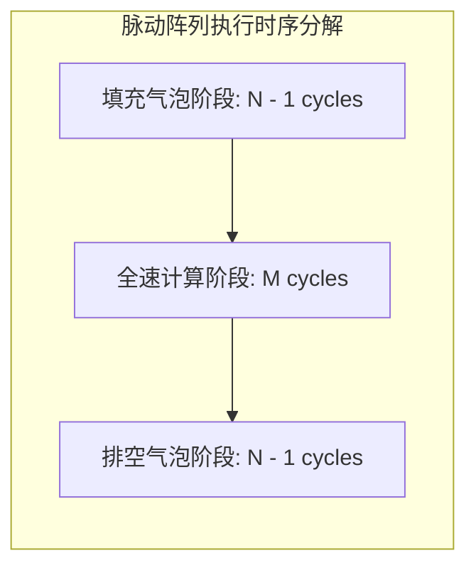

# 07 脉动流水气泡 (Bubbles) 与利用率模型

## 1. 脉动阵列对角线倾斜注入延迟推导

对于 $N \times N$ 的 2D 脉动阵列，计算矩阵乘 $(M \times K) \times (K \times N)$：

### 2. 利用率数学公式与数值实例
$$\text{MAC 实际有效利用率} = \frac{M \times K \times N}{(M + N + K - 2) \times N^2}$$
- 设 $N = 128$：
  - 当 $M = 1$（LLM 单 Token 生成）：利用率仅 **0.39%**（严重气泡）；
  - 当 $M = 128$：利用率上升至 **33.5%**；
  - 当 $M = 2048$（大 Batch Prefill）：利用率高达 **89.3%**。
