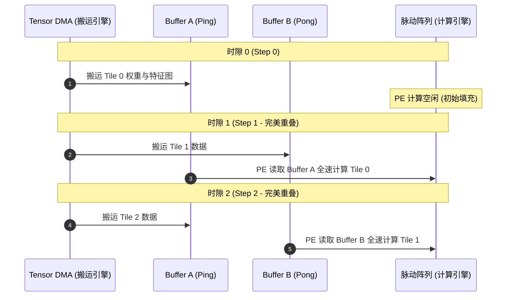

# 02 Ping-Pong 双缓冲硬件设计与时序状态机

## 1. 算力与搬运 100% 异步重叠

```mermaid
sequenceDiagram
    autonumber
    participant DMA as Tensor DMA (搬运引擎)
    participant Ping as Buffer A (Ping)
    participant Pong as Buffer B (Pong)
    participant PE as 脉动阵列 (计算引擎)

    Note over DMA, PE: 时隙 0 (Step 0)
    DMA->>Ping: 搬运 Tile 0 权重与特征图
    Note over PE: PE 计算空闲 (初始填充)

    Note over DMA, PE: 时隙 1 (Step 1 - 完美重叠)
    DMA->>Pong: 搬运 Tile 1 数据
    Ping->>PE: PE 读取 Buffer A 全速计算 Tile 0

    Note over DMA, PE: 时隙 2 (Step 2 - 完美重叠)
    DMA->>Ping: 搬运 Tile 2 数据
    Pong->>PE: PE 读取 Buffer B 全速计算 Tile 1
```

- **硬件双缓冲状态机**：由硬件 `DMA_Done` 与 `Compute_Done` 两个标志位寄存器自动触发双缓冲指针翻转，消除一切等待气泡。
