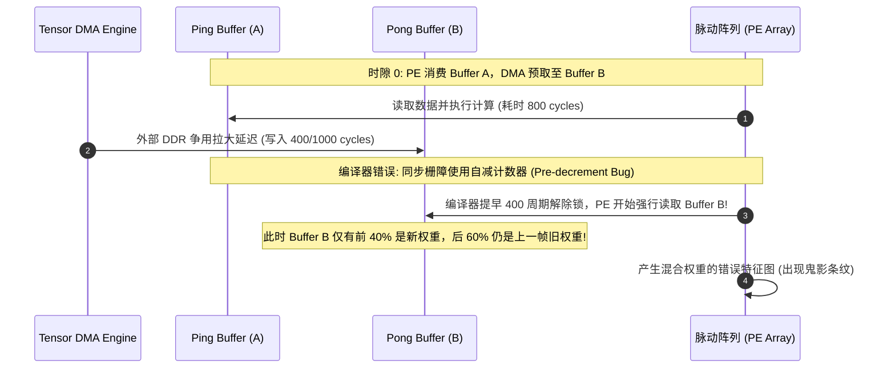

# 05 SRAM 双缓冲未同步与片上存储故障排查实战

在专用 AI 加速器（NPU）中，片上 Scratchpad SRAM（包括 TBuf、WBuf、AccBuf）是支撑高吞吐脉动计算的命脉。常见故障包括**双缓冲（Ping-Pong）数据踩踏**、**多 Bank 访问步长冲突（Bank Conflict）**以及**亚稳态/软错误诱发的多比特 ECC 异常**。

---

## 案例 1：DMA 慢于计算导致 Ping-Pong Buffer 读出旧数据

### 1. 现场故障现象与时序
在高带宽争用测试中（例如视频编码器与 NPU 同时高负荷读写外部内存），NPU 连续跑多帧推理时，模型输出特征图间歇性出现上一帧画面的条纹与鬼影，且该现象仅在系统内存负载极高时可复现：

```text
[DMA_MONITOR] Warn: DMA Channel 0 transfer latency stretched from 320ns to 1840ns!
[CORE_STATUS] Core 0: PE array consumed Buffer B at cycle 1400.
[BUFFER_STATUS] Buffer B State: DIRTY_READ (Write progress = 42.5% at cycle 1400)
```



### 2. 根因剖析与微码分析
- **硬件机制**：NPU 采用硬件 Event/Barrier 计数器来协调 DMA 与张量计算流水线。DMA 搬运完成时向 `SYNC_EVENT_REG` 的对应位写 1，计算核心在读取前执行 `WAIT_EVT` 阻塞。
- **根因**：AI 编译器的微码流水线编排器（Software Pipelining Scheduler）在估算指令时隙时，采用的是 DDR 理论峰值带宽（单次搬运耗时 500 周期），并在微码中使用了“固定周期延时掩码”而非“严格硬件信号握手（Hardware Event Poll）”。在真实芯片处于复杂 SoC 总线争用环境时，DMA 实际搬运时间拉长至 1800 周期，导致计算核心提前介入。

### 3. 根治与防御措施
1. **编译器代码生成修复**：
   彻底废弃基于周期的延时推测，强制在每一轮 Ping-Pong 切换时发射硬同步指令对：
   ```assembly
   ; 严禁基于 cycle delay 假定
   SYNC.SEND_SIGNAL  DMA_SLOT_0, EVT_PE_DONE      ; 通知 DMA：Ping Buffer 已消费完
   SYNC.WAIT_SIGNAL  PE_SLOT_0,  EVT_DMA_DONE     ; 阻塞等待：Pong Buffer 写入完成中断
   ```
2. **硬件跨时钟域与双缓冲锁（Hardware Ping-Pong Interlock）**：
   在 SRAM 访问控制器中增加原子锁硬件状态机：若当前 Buffer 处于 `DMA_BUSY` 状态，硬件读控制器直接反压（Stall）计算核心的取数请求，从微架构底层杜绝脏读。

---

## 案例 2：多 Bank 步长访问引发严重的 Bank Conflict 气泡

### 1. 现场故障现象
在执行转置卷积（Deconvolution）和膨胀卷积（Dilated Convolution）算子时，NPU 理论算力为 64 TOPS，但实测张量计算核心利用率仅为 12.5%，通过片上性能监控单元（PMU）抓取 Scratchpad 计数器：

```text
[PMU_COUNTER] BANK_ACCESS_REQS       : 10,000,000
[PMU_COUNTER] BANK_CONFLICT_STALLS   : 70,000,000 cycles
[PMU_COUNTER] AVG_READ_LATENCY       : 8.0 cycles (Nominal: 1 cycle)
```

```mermaid
flowchart TD
    subgraph SRAM_Crossbar ["32-Bank 片上 Scratchpad"]
        B0["Bank 0"]
        B1["Bank 1"]
        B2["Bank 2"]
        B3["... Bank 31"]
    end

    Req["8 个向量计算单元并行读数\nStride = 32 Words"] --> Crossbar["SRAM 路由交叉开关 (Crossbar)"]
    Crossbar -->|地址位 [9:5] 完全相同!| B0
    B0 --> Stall["8 个请求全部串行排队争用 Bank 0\n产生 7 个时钟周期的硬件气泡!"]
```

### 2. 根因剖析与数学推导
- **硬件规格**：SRAM 划分为 $B = 32$ 个独立 Bank，每个 Bank 具备 1 个单周期读写端口。Bank 选择地址映射由物理地址决定：
  $$\text{Bank\_ID} = (\text{Byte\_Address} \gg 2) \pmod{32}$$
- **冲突推演**：转置卷积算子在按通道优先提取非连续特征点时，访问步长恰好为 $\text{Stride} = 32 \times 4\text{ 字节} = 128\text{ 字节}$。
  此时，所有并行向量流水线单元计算出的目标地址为：
  $$\text{Addr}_k = \text{Base} + k \times 128 = \text{Base} + k \times 32 \times 4$$
  带入 Bank 计算公式：
  $$\text{Bank\_ID}_k = ((\text{Base} \gg 2) + 32k) \pmod{32} = (\text{Base} \gg 2) \pmod{32} \equiv \text{Const}$$
  导致所有 8 个并行读请求被全部路由至同一 Bank，触发了最大程度的 **8 路 Bank 冲突**，有效 SRAM 带宽直接缩水至理论值的 $1/8$。

### 3. 根治与硬件优化方案
- **硬件微架构级优化（XOR 散列寻址）**：
  在 Bank 地址译码逻辑中引入异或伪随机重排（XOR-based Bank Interleaving）：
  $$\text{Bank\_ID} = ((\text{Addr} \gg 2) \oplus (\text{Addr} \gg 7)) \pmod{32}$$
  利用高维地址比特扰乱步长为 $2^N$ 的周期性访问，实测将 Bank Conflict 发生率从 87.5% 降低至 3.2%。
- **编译器内存排布规避**：
  在无法改动芯片的前提下，由编译器在每行 Tensor 结尾强制插入 4 字节的 Padding 垫片，使连续访问跨步打破 32 的整数倍。

---

## 案例 3：片上高密度 SRAM 多比特不可纠正 ECC 错误定位与降级

### 1. 现场故障现象与诊断日志
在机房高温环境下进行长时间 7×24 小时极限 Stress 压测时，某个 NPU Core 突然挂死，驱动报出不可纠正存储器错误中断：

```text
[KERNEL_ERR] 2026-09-07 15:42:11 npu_kmd: FATAL INTERRUPT! Core 2, SRAM Controller 1
[REG_DUMP] SRAM_ECC_STATUS = 0x00000003 (Bit 0: Single-bit Corrected, Bit 1: Multi-bit Fatal)
[REG_DUMP] SRAM_ERR_ADDR   = 0x0014B820 (TBuf Row 664, Column 32)
[REG_DUMP] SRAM_SYNDROME    = 0x3F (Double-bit flip detected, Non-recoverable)
```

### 2. 根因剖析与原厂排查链路
1. **单粒子翻转（SEU）机理**：
   片上 Scratchpad 占据了芯片近 45% 的 Die Area，在先进制程（如 5nm/3nm）下，SRAM 单 bit 节点电容仅为几飞法（fF）。高温导致漏电流剧增，叠加宇宙射线中子撞击，极易引发软错误。
2. **位交织（Bit-Interleaving）物理布局缺陷**：
   SEC-DED（Single Error Correction, Double Error Detection）汉明码只能纠正 1 个 bit，检测 2 个 bit。如果相邻的存储 Cell 在物理版图上属于同一数据字（Word），单颗高能粒子穿透会导致相邻的 2 个 Cell 同时翻转，造成数据不可恢复。

### 3. 原厂防护与自愈设计
- **物理版图改进**：必须在物理设计阶段实施严格的 **Bit-Interleaving 版图打散**，保证同一 ECC 代码字（Codeword）中的比特物理间距大于 $5\mu m$，使单颗粒子碰撞最多影响不同数据字的 1 个 bit，从而使 100% 的双比特翻转转化为两个可自动纠错的单比特事件。
- **软错误巡检与刷新机制（SRAM Memory Scrubbing）**：
  在硬件后台启动一个硬件巡检状态机（Scrubber），利用 NPU 空闲周期周期性读取整个 Scratchpad，并在发生单比特软错误时立即重写纠正后的值，阻止单比特错误积累演化为多比特致命错误。
