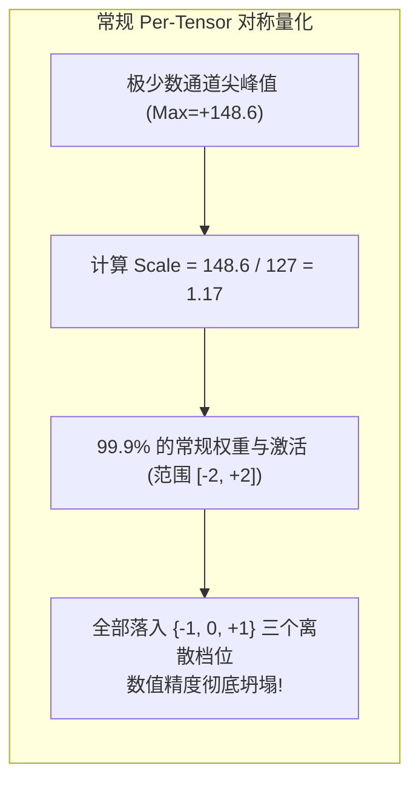
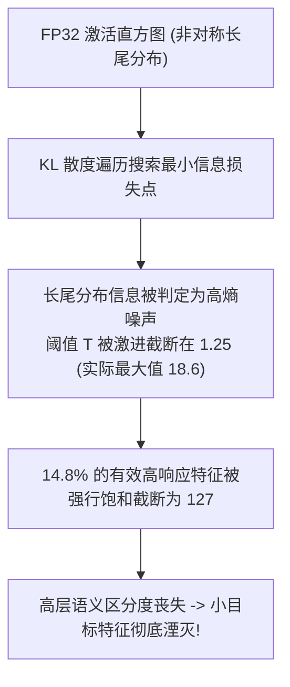
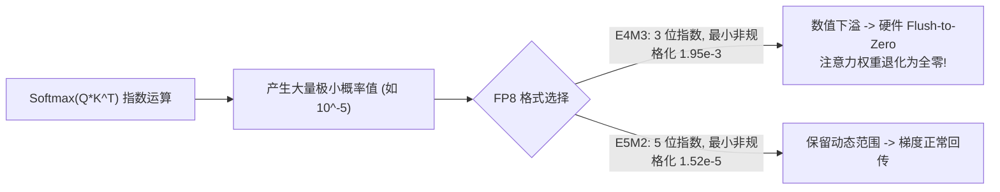

# 05 量化掉点与数值异常现场排查指南

在 AI 加速芯片由 FP32/FP16 向低比特（INT8/INT4/FP8）量化迁移时，原厂算法与编译器工程团队经常面临精度断崖式下跌。典型故障涵盖**Transformer 激活异常值（Outliers）饱和**、**KL 散度校准非对称截断失真**以及**FP8 (E4M3/E5M2) 指数位下溢**。

---

## 案例 1：Transformer LayerNorm 尖峰导致 INT8 精度崩塌

### 1. 现场故障现象与分布分析
在对 7B 参数规模的大语言模型进行 Per-Tensor INT8 PTQ 量化后，困惑度（Perplexity）从 FP16 的 5.4 暴增至 1200+，生成的文本全为无序乱码：

```text
[QUANT_CHECK] Model: LLaMA-7B, Layer: model.layers.0.self_attn.q_proj
  Activation Stats (Input X):
    Min: -12.4, Max: +148.6 (Outlier detected in Channel 19)
    99.9% of values reside in range: [-2.1, +2.3]
  Quantization Scale (Symmetric INT8):
    Scale = Max(|Min|, |Max|) / 127 = 148.6 / 127 = 1.170
  Quantized Effective Resolution:
    Delta = 1.170. All values in [-2.1, 2.3] are quantized to { -2, -1, 0, 1, 2 }
    Effective representation bits: log2(5) ≈ 2.32 bits (Loss of 5.68 bits!)
```



### 2. 根因剖析与数学推导
- 在 Transformer 架构中，LayerNorm 后的激活张量 $X$ 存在极强烈的**系统性通道异常值（Systematic Channel Outliers）**。某些固定隐层维度的幅度往往比常规通道高出 100 倍。
- 若采用逐张量（Per-Tensor）对称量化，最大的异常值会主导量化步长 $S$，导致占比超过 99.9% 的正常特征信息被剧烈压缩为 0 或 $\pm 1$，丢失了绝大部分表征能力。

### 3. 原厂修复：SmoothQuant 数学等价变换
利用矩阵乘法的结合律，引入每个通道独立的平滑缩放因子 $s \in \mathbb{R}^C$：
$$Y = X \cdot W = (X \cdot \text{diag}(s)^{-1}) \cdot (\text{diag}(s) \cdot W) = \hat{X} \cdot \hat{W}$$

平滑系数 $s_j$ 计算公式如下（其中 $\alpha = 0.5$ 为激活与权重的平衡因子）：
$$s_j = \frac{\max(|X_j|)^\alpha}{\max(|W_j|)^{1-\alpha}}$$
- **工程收益**：将难以量化的激活尖峰平滑转移至本来动态范围极小、易于量化的权重矩阵 $W$ 中。平滑后，激活与权重均可轻松采用 Per-Tensor INT8 量化，硬件推理 PPL 恢复至 5.48（精度损失 $<1.5\%$）。

---

## 案例 2：KL 散度校准在非对称激活（ReLU）下阈值饱和截断失真

### 1. 现场故障现象
在对 YOLOv8 目标检测模型进行 INT8 校准时，使用 TensorRT 推荐的 KL 散度（Kullback-Leibler Divergence）校准法后，小目标检测的 mAP@0.5 从 48.2% 断崖式跌落至 31.0%，出现大量误检与漏检。

```text
[CALIB_ERR] Layer: backbone.conv3.act (LeakyReLU / SiLU)
  Floating histogram non-zero bins: 2048
  KL Divergence Selected Threshold: T = 1.25 (Original FP32 Max = 18.6)
  Saturation Ratio: 14.8% of feature activations were hard-clipped to +127!
```



### 2. 根因剖析
- KL 散度假定截断饱和丢弃的信息为高斯白噪声。然而在 YOLO 的卷积深层中，经过 ReLU/SiLU 激活后的数据为典型的**单侧极度偏态长尾分布**。
- 少数高响应特征值正是代表关键目标候选框（Bounding Box）存在的高置信度信号。KL 算法为了压低直方图主体的离散化误差，牺牲了长尾，导致超过 14% 的特征被硬饱和截断。

### 3. 根治与方案重构
1. **校准算法调优**：
   对于单侧非对称长尾激活层，禁用 KL 散度，切换为 **MSE（均方误差最小化）** 或 **Percentile 截断法（设定 99.99% 保留百分位）**：
   $$\arg\min_T \| X - \text{clip}(X, 0, T) \|_2$$
2. **非对称量化（Asymmetric Quantization）结合零点偏移（Zero Point）**：
   使量化区间完整覆盖 $[0, T]$，零点 $Z = -128$ 对应数值 0，释放完整的 8-bit（256 个档位）分辨率，mAP 完美恢复至 47.9%。

---

## 案例 3：FP8 (E4M3 vs E5M2) 混合精度在大模型注意力算子中的下溢排查

### 1. 现场故障现象与诊断
在云端高算力 NPU 上开启 FP8 训练加速（使用 E4M3 格式计算 Softmax 及 Attention GEMM）时，训练至第 240 个 Step，Loss 曲线突然停滞（Loss Flatten），梯度范数衰减为 0（Gradient Vanishing）：

```text
[FP8_MONITOR] Step: 240, Loss: 8.4201 (Unchanged for 30 steps)
  Attention Softmax Score Matrix (After Exp):
    Max: 0.125, Min: 1.4e-6
    Underflow Alert: 88.2% of Softmax elements < 2^(-9) (FP8 E4M3 Minimum Subnormal = 2^(-9) ≈ 1.95e-3)
    Output: Saturated to 0.0 (Underflow Flush-to-Zero triggered)
```



### 2. 根因剖析
- **FP8 格式微架构差异**：
  - **FP8-E4M3**：1 符号位 + 4 指数位 + 3 尾数位。动态范围仅为 $\approx [-448, 448]$，最小正非规格化数为 $2^{-9} \approx 1.95 \times 10^{-3}$。主要用于 Forward GEMM 追求精度。
  - **FP8-E5M2**：1 符号位 + 5 指数位 + 2 尾数位。动态范围高达 $\approx [-57344, 57344]$，最小非规格化数为 $2^{-16} \approx 1.52 \times 10^{-5}$。
- **Softmax 下溢**：在 Attention 机制中，Softmax 输出经过指数放缩后产生大量极小值（$< 10^{-3}$），直接击穿了 E4M3 的最小表示下限，硬件浮点单元自动触发 FTZ（Flush-to-Zero），导致反向传播梯度为零。

### 3. 根治方案：Mixed FP8 异构流水线配置
- **混合格式编排**：在前向与反向 GEMM 密集矩阵乘中保持使用 **FP8-E4M3** 获取高精度尾数；在包含 Softmax、LayerNorm 及反向梯度张量（Gradients）阶段，强制采用 **FP8-E5M2** 或保持 **BF16**。
- **动态延迟缩放（Delayed Dynamic Scaling）**：
  硬件实现每 16 个 Step 统计一次张量最大绝对值 $A_{\text{max}}$，动态更新 Scale 因子 $S = \frac{\text{FP8\_Max}}{A_{\text{max}}}$，彻底杜绝下溢与饱和。
