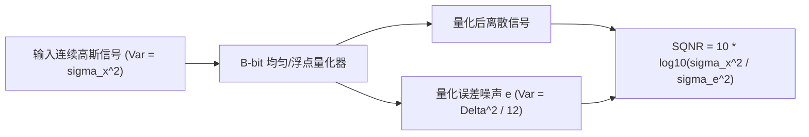

# 06 FP8 与 Microscaling 量化信噪比 (SQNR) 推演

## 1. 量化信噪比 (SQNR) 理论数学模型

设输入连续张量 $X$ 服从零均值高斯分布 $X \sim \mathcal{N}(0, \sigma_x^2)$，量化阶距为 $\Delta = \frac{2 x_{max}}{2^B - 1}$：
- 量化误差近似为均匀白噪声 $e \sim U\left(-\frac{\Delta}{2}, \frac{\Delta}{2}\right)$，其噪声功率为：
  $$\sigma_e^2 = \mathbb{E}[e^2] = \frac{\Delta^2}{12} = \frac{x_{max}^2}{3 \times (2^B - 1)^2}$$
- **量化信噪比 (Signal-to-Quantization-Noise Ratio, SQNR)** 严格定义为：
  $$\text{SQNR (dB)} = 10 \log_{10}\left(\frac{\sigma_x^2}{\sigma_e^2}\right) \approx 6.02 B + 4.77 - 20 \log_{10}\left(\frac{x_{max}}{\sigma_x}\right)\text{ dB}$$

---

## 2. INT8、FP8 与 Microscaling (MXFP4) 精度与带宽全维度对比

设大语言模型参数量 $\Phi = 70\text{B}$（$70 \times 10^9$ 参数）：

| 量化数据格式 | 位宽构成 (Sign + Exp + Mantissa) | 理论有效 SQNR (dB) | 70B 模型权重体积 (GB) | 显存带宽节省率 (%) | 相对 FP16 精度掉点 |
| :--- | :--- | :--- | :--- | :--- | :--- |
| **FP16 / BF16** | $1 + 5 + 10$ 或 $1 + 8 + 7$ | ~98.08 dB | 140.0 GB | 基准 (0%) | 0.00% (基准) |
| **INT8 对称** | $1 + 0 + 7$ (定点整数) | 49.92 dB | 70.0 GB | **50.0%** | < 0.15% (需 Outlier 处理) |
| **FP8 (E4M3)** | $1 + 4 + 3$ (浮点) | 54.21 dB | 70.0 GB | **50.0%** | < 0.05% (高精度推理) |
| **FP8 (E5M2)** | $1 + 5 + 2$ (浮点大动态) | 46.85 dB | 70.0 GB | **50.0%** | < 0.10% (反向梯度计算) |
| **MXFP4 (OCP)** | 32 个元素共享 8-bit Scale + 4-bit 尾数 | 42.60 dB | **39.375 GB** | **71.88%** | < 0.35% (极限吞吐) |

- **推导结论**：MXFP4 通过将 32 个连续浮点数归一化至共享的 8-bit 指数基底，不仅使单参数存储位宽从 16-bit 降至 $4 + \frac{8}{32} = 4.25\text{ bit}$，而且彻底消除了大模型中的局部激活异常值溢出问题。
