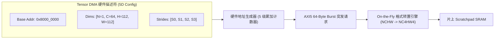

# 01 Tensor DMA 多维 Stride 寻址与硬件地址生成器

## 1. 多维张量搬运的物理痛点与硬件 AGU

```mermaid
graph LR
    subgraph Desc["Tensor DMA 硬件描述符 (5D Config)"]
        Base["Base Addr: 0x8000_0000"]
        Dim["Dims: [N=1, C=64, H=112, W=112]"]
        Stride["Strides: [S0, S1, S2, S3]"]
    end

    Desc --> AGU["硬件地址生成器 (5 级累加计数器)"]
    AGU --> AXI_Master["AXI5 64-Byte Burst 突发请求"]
    AXI_Master --> TransposeEngine["On-the-Fly 格式转置引擎 (NCHW -> NC4HW4)"]
    TransposeEngine --> SRAM["片上 Scratchpad SRAM"]
```

- 硬件实时生成连续物理突发地址，消除 CPU 频繁下发小 DMA 事务的开销。
