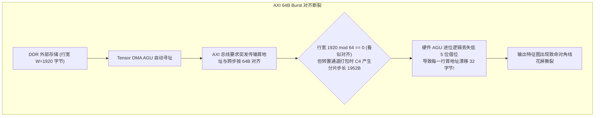
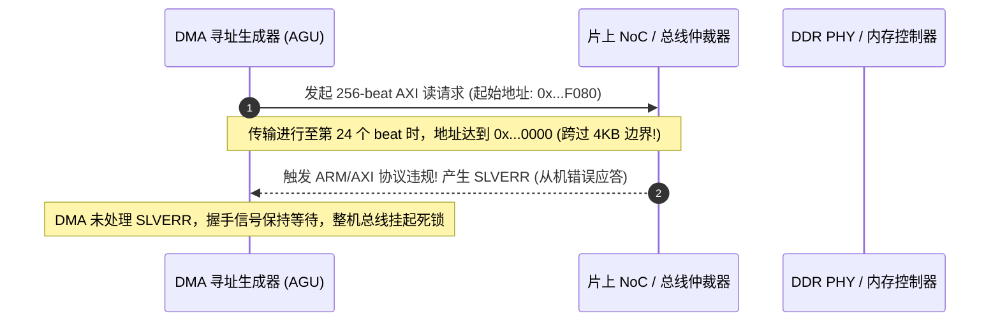
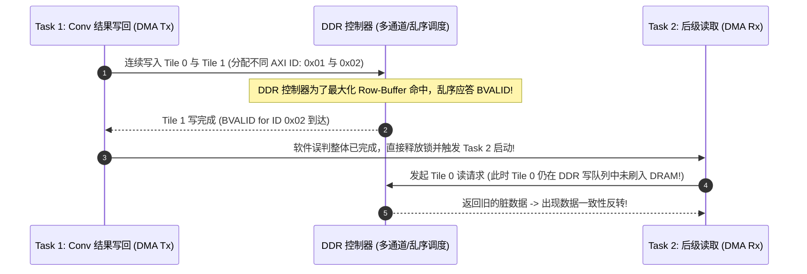

# 05 Tensor DMA 搬运异常与总线故障排查指南

在专用 AI 加速器中，Tensor DMA 承担高维张量在外部 DDR/HBM 与片上 Scratchpad 之间的转置、重排（Packing）与高吞吐搬运。典型工程故障包括**多维步长对齐失准**、**AXI 突发跨越 4KB 边界异常**以及**写响应乱序（Out-of-Order Completion）死锁**。

---

## 案例 1：NCHW 转 NC4HW4 转置引擎 Stride 偏移错位

### 1. 现场故障现象与图像形变
在执行摄像头输入的 1080p（$1920 \times 1080 \times 3$）图像预处理并写入 NPU 片上 SRAM 时，后级目标检测模型输出完全崩溃。将 SRAM 中的输入张量导回 CPU 查看，发现整幅画面沿着水平方向呈现周期性“对角撕裂”与锯齿状伪影：

```text
[DMA_DUMP] Channel 0: Transpose Engine Active. Source: NCHW, Dest: NC4HW4
  Tensor Dimensions: C=3, H=1080, W=1920, Element: UINT8 (1 Byte)
  Allocated Stride_H in SRAM: 1920 Bytes (Misaligned to 64B burst!)
  Actual Hardware Output:
    Line 0: Correct (Offset 0x0000)
    Line 1: Shifted right by 32 bytes (Offset 0x0780 -> 0x07A0)
    Line 2: Shifted right by 64 bytes (Severe diagonal shearing observed)
```



### 2. 根因剖析与步长对齐公式
- **微架构逻辑**：Tensor DMA 内部包含 2D/5D 寻址生成单元（AGU）。为了最大化 AXI5 突发吞吐，AGU 将多维循环展开为连续的 64 字节 AXI Burst。
- **根因推演**：在执行 `NC4HW4`（每 4 个 Channel 连续打包）时，每个像素占用 4 个字节，行步长本应为 $1920 \times 4 = 7680$ 字节。但在进行局部子块切片（Tile 宽 $W_{\text{tile}} = 480$）时，硬件要求步长 $\text{Stride} = W_{\text{tile}} \times 4 = 1920$ 字节。当编译器对非整除的分辨率执行边界裁剪时，未对 Tile 步长向上按 64 字节取整，导致 AGU 地址累加器产生未对齐截断，触发内部 FIFO 读写指针相位错位。

### 3. 根治与编译器代码生成约束
在 AI 编译器底层代码生成器中强制注入硬件对齐约束，严禁发射任何非 64 字节对齐的跨步：
$$\text{Aligned\_Stride} = \lceil \frac{W_{\text{tile}} \times \text{PixelSize}}{64} \rceil \times 64$$
同时在 DMA 控制器状态机中增加硬件断言检查：若 `STRIDE_REG & 0x3F != 0`，控制器立即拉高配置错误中断（`CFG_ALIGN_ERR`），拒绝启动搬运。

---

## 案例 2：AXI 突发传输跨越 4KB 地址边界触发 SLVERR 异常

### 1. 现场故障现象
在将云端大模型权重（16GB 矩阵）通过多通道 Tensor DMA 快速灌入片上高带宽缓存时，系统随机发生总线死锁，NPU 核心抛出 AXI 严重错误：

```text
[KERNEL_PANIC] npu_dma 0000:01:00.0: AXI Master Interface Fault!
[REG_DUMP] DMA_STATUS       = 0x80000002 (Error: SLVERR received on R-Channel)
[REG_DUMP] DMA_CURR_SRC_ADDR= 0x7FFF_FFFF_F080 (Near 4KB page boundary!)
[REG_DUMP] DMA_BURST_LEN    = 0xFF (256 beats, AXI INCR burst)
[BUS_DECODER] NoC Firewall: Transaction 0x7FFF_FFFF_F080 crossed 4KB boundary (0x8000_0000_0000)
```



### 2. 根因剖析
- **AXI 协议规范**：ARM AMBA AXI4/AXI5 协议明确规定：**任何突发传输（Burst Transaction）均不得跨越 4KB 地址边界**。原因在于系统 MMU/IOMMU 采用 4KB 作为最小物理页管理粒度，跨界传输极可能落入不同的物理页或未授权地址空间，危及内存安全。
- **DMA 缺陷**：驱动下发大块连续 DMA 描述符时，仅配置了总长度和基地址，底层的 DMA 硬件分包逻辑（Packet Slicer）未对 4KB 边界进行动态截断与自动重组，导致长突发（Burst Length = 256）直接撞穿 4KB 边界。

### 3. 根治方案：硬件自动分包切片器（Auto 4KB Slicer）
在 Tensor DMA 的硬件 Master 接口中集成 4KB 边界感知流水线：
1. **边界余量计算**：
   $$\text{Bytes\_to\_Boundary} = 4096 - (\text{Addr} \ \& \ 0xFFF)$$
2. **动态突发截断**：
   $$\text{Burst\_Len}_{\text{actual}} = \min(\text{Req\_Len}, \lfloor \frac{\text{Bytes\_to\_Boundary}}{\text{AXI\_Bus\_Bytes}} \rfloor)$$
   若单次传输超出边界，硬件自动将其平滑拆分为两个独立的 AXI 事务，彻底消除跨界违规。

---

## 案例 3：AXI 写响应乱序（Out-of-Order）导致多任务数据依赖反转

### 1. 现场故障现象与诊断
在多任务并发场景下（任务 1 执行 Conv 计算并将特征图写回 DDR，任务 2 紧接着通过 DMA 将该特征图读入后处理引擎），系统在 1% 的概率下输出空特征图或旧数据：



### 2. 根因剖析
- 现代片上总线为了提高访存利用率，支持针对不同 AXI `AWID` 的写响应乱序返回（Out-of-Order BVALID）。
- DMA 控制器在追踪任务完成状态时，内部维护了一个简单的计数器 `Outstanding_Tx_Count`，当收到任意 `BVALID` 时计数器减 1。
- 软件驱动与编译器的多任务调度器在等待某个特定缓冲区写完成时，错误地依赖了局部计数器归零，未能感知到不同 Tile 的完成状态与硬件 Flush 屏障，导致下游消费者在数据实际落盘前被提前唤醒。

### 3. 原厂加固方案
- **严格 ID 追踪机制**：DMA 控制器升级为具备 CAM（内容寻址寄存器）的事务跟踪表，精确记录每个 `AWID` 的应答状态；
- **全系统内存栅障（System Memory Barrier）**：在两个依赖任务之间强制由 Command Processor 插入一条 `DMA_BARRIER` 微码，向 DDR 控制器广播 Drain 命令，强制等待所有 Outstanding 写响应 100% 确认收敛。
