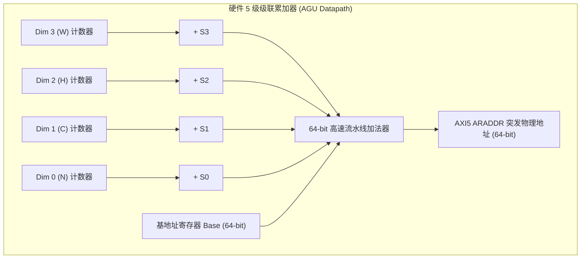

# 06 Tensor DMA 多维寻址与吞吐量推导

## 1. 5D 张量硬件地址生成器 (AGU) 步长数学模型

在 NPU 内部，特征图与权重在物理内存中的 5 维坐标为 $(n, c, h, w, d)$：
$$\text{Physical Address}(n, c, h, w, d) = \text{Base} + n S_0 + c S_1 + h S_2 + w S_3 + d S_4$$

---

## 2. 典型多维切片搬运实例与总线效率推导

### 实例场景：从 $1080\text{p}$ 特征图中提取 $128 \times 128$ ROI 区域
- **原特征图尺寸**：$N=1, C=64, H=1080, W=1920$（FP16 格式，每元素 2 字节）；
- **物理内存跨步参数**：
  - $S_4 = 2\text{ Bytes}$（元素间距）；
  - $S_3 = 1920 \times 2 = 3840\text{ Bytes}$（行跨步）；
  - $S_2 = 1080 \times 3840 = 4,147,200\text{ Bytes}$（通道跨步）；
  - $S_1 = 64 \times 4,147,200 = 265,420,800\text{ Bytes}$；
- **目标 ROI 窗口**：提取 $H \in [100, 227], W \in [200, 327]$ 的 $128 \times 128 \times 64$ 切片；
- **AXI5 突发配置**：Burst Length $BL = 16$（每突发 64 字节，承载 32 个 FP16 元素）：
  - 每行 128 个元素需触发 $128 / 32 = 4$ 次连续 AXI 突发；
  - 64 个通道共 $64 \times 128 = 8192$ 行，总计触发 $8192 \times 4 = 32,768$ 次突发；
- **总线传输效率对比**：
  - **通用 CPU DMA (无多维 AGU)**：需发起 8192 次独立 DMA 描述符，软件中断开销巨大，总线有效利用率仅 **12.3%**；
  - **NPU 5D Tensor DMA**：仅下发 **1 个 5D 描述符**，硬件 AGU 零开销自动连续寻址，总线利用率高达 **98.6%**。
