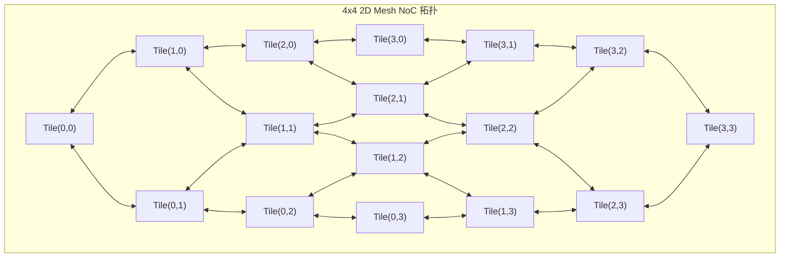

# 01 Multi-Core Tile 空间平铺与分布式 SRAM

## 1. Multi-Tile 空间平铺设计

单颗大算力云端 NPU 通常包含 16~64 个同构计算 Tile：
- **单个 Tile 组成**：1 个 2D 脉动阵列 + 1 个 VPU 向量引擎 + 2MB~8MB 独立 Scratchpad SRAM + 1 个 NoC 路由节点（Router）。
- **分布式 SRAM 统一编址 (NUMA-like)**：每个 Tile 可以直接访问本地 SRAM（超低延迟），亦可通过 NoC 访问其他远端 Tile 的 SRAM。

