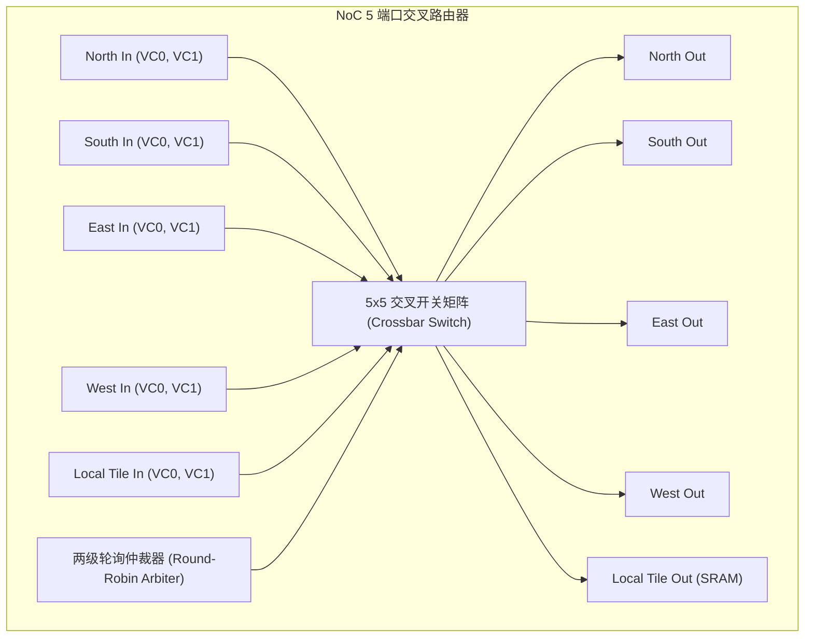

# 02 2D Mesh NoC 路由器微架构与 XY 路由算法

## 1. 2D Mesh 路由器微架构 (Router Microarchitecture)

每个 Tile 节点内的 NoC 路由器由 5 个双向物理端口（North, South, East, West, Local）与交叉开关（Crossbar Switch）构成：

---

## 2. XY 维序路由算法 (Dimension-Order Routing) 形式化证明

- **算法规则**：数据包的坐标寻址为 $(X_{dst}, Y_{dst})$。当前路由器坐标为 $(X_{curr}, Y_{curr})$：
  1. 若 $X_{curr} < X_{dst}$，路由至 **East** 端口；
  2. 若 $X_{curr} > X_{dst}$，路由至 **West** 端口；
  3. 若 $X_{curr} = X_{dst}$ 且 $Y_{curr} < Y_{dst}$，路由至 **South** 端口；
  4. 若 $X_{curr} = X_{dst}$ 且 $Y_{curr} > Y_{dst}$，路由至 **North** 端口；
  5. 若坐标完全匹配，路由至 **Local** 端口。
- **无死锁证明（Deadlock-Free Proof）**：由于数据包一旦转向 Y 维度后严禁再次转向 X 维度，信道依赖图（Channel Dependency Graph）中严格不存在任何闭环回路（No Cycles），在数学上严格保证 100% 免疫死锁。
