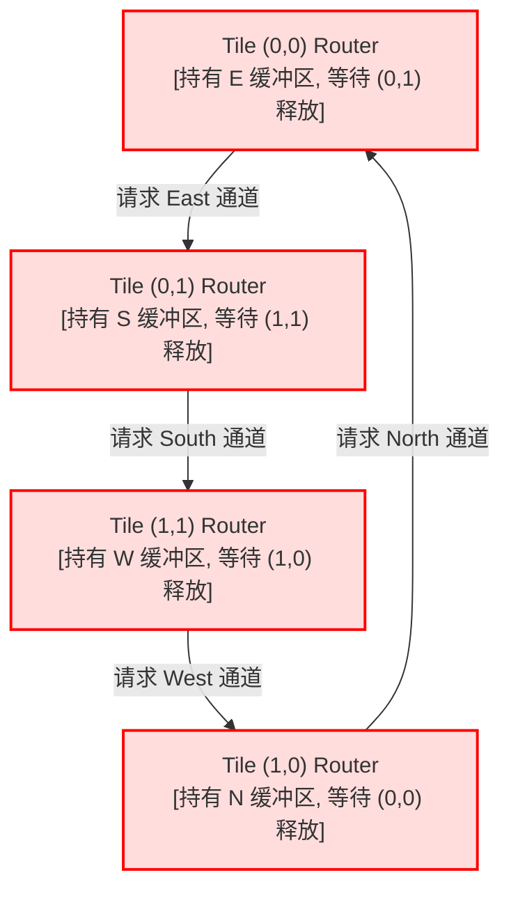
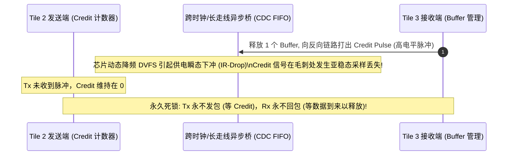
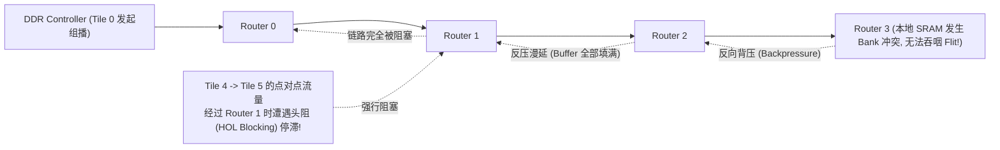

# 05 2D Mesh NoC 互联死锁与路由拥塞调试实战

在多核/多 Tile 互联架构中，片上网络（Network-on-Chip, NoC）负责承载各 Compute Tile、SRAM Tile 与 DDR/HBM 内存控制器之间的高速报文交换。常见深层故障包括**路由依赖环路死锁**、**基于 Credit 的流控计数器失步**以及**组播树单点背压引发的整网头阻死锁（Head-of-Line Blocking）**。

---

## 案例 1：自适应动态路由违背 Turn Model 引发 4-Tile 闭环死锁

### 1. 现场故障现象与状态抓取
在运行 MoE（混合专家模型）全互联 All-to-All 门控路由通信阶段，全芯片 16 个 Tile 全部停止工作。通过 JTAG CoreSight 抓取片上 NoC 路由器的状态寄存器：

```text
[NOC_FAULT] Router (0,0): East Port Output FIFO 100% Full, Flit blocked at Head
[NOC_FAULT] Router (0,1): South Port Output FIFO 100% Full, Flit blocked at Head
[NOC_FAULT] Router (1,1): West Port Output FIFO 100% Full, Flit blocked at Head
[NOC_FAULT] Router (1,0): North Port Output FIFO 100% Full, Flit blocked at Head
[TOPOLOGY_STATE] Channel Dependency Graph: CYCLE DETECTED [(0,0)->(0,1)->(1,1)->(1,0)->(0,0)]
```



### 2. 根因剖析与通道依赖图（CDG）理论
- **死锁机理**：根据 Dally 的通道依赖图理论，无死锁路由的充要条件是**依赖图中不存在任何有向环**。
- **Turn Model 违规**：在设计阶段，为了缓解单链路拥塞，固件使能了“微自适应拥塞回避算法”。当 East 拥塞时允许报文临时转向 South，在 South 拥塞时允许转向 West。这种无约束的动态拐弯同时引入了 $E \rightarrow S$、$S \rightarrow W$、$W \rightarrow N$ 以及 $N \rightarrow E$ 四种转向，直接闭合了顺时针通道依赖环（Clockwise Cycle）。当 4 个报文同时填满各自的缓冲区并寻求下一步转发时，硬件形成彻底的循环资源等待死锁。

### 3. 根治与芯片配置约束
1. **硬件路由强锁定：XY 维序路由（Dimension Order Routing, DOR）**：
   在 NoC 路由器配置寄存器 `ROUTER_CFG` 中，强制将路由算法锁定为纯确定性 XY-DOR：**所有报文必须严格先沿 X 轴（East/West）路由，到达目标列后再沿 Y 轴（North/South）路由**。严禁任何 $Y \rightarrow X$ 的转弯，从数学定理层面彻底切断依赖环路。
2. **多虚通道（Virtual Channel, VC）逃逸通道设计**：
   若必须支持自适应路由，则必须将物理链路划分为 2 个虚通道：VC0 运行自适应路由，VC1 作为确定性 XY 逃逸通道（Escape Virtual Channel）。一旦报文在 VC0 停顿超过 64 周期，强制降级转移至 VC1 逃逸排出。

---

## 案例 2：Credit-based 流控计数器亚稳态下溢导致虚通道永久挂死

### 1. 现场故障现象
在连续 48 小时持续跑大模型解码（Decode）单 Token 极短报文时，Tile 2 向 Tile 3 发送数据突然停滞，但相邻其他 Tile 间通信完全正常。读取 Tile 2 出口路由器寄存器：

```text
[REG_READ] Router(2,0)_Port_East_VC0_CREDIT = 0 (No available flit credit)
[REG_READ] Router(3,0)_Port_West_VC0_FREE_BUF = 16 (All 16 buffer slots are empty!)
[STATUS] Mismatch: Sender thinks Receiver is FULL; Receiver is actually completely EMPTY.
```



### 2. 根因剖析
- NPU 内部 2D Mesh 跨核距离较长，采用 **Credit-Based 流控**（接收端每消耗一个 Flit，向上游发送一个 1-bit 的 Credit 脉冲，上游计数器加 1；发送一个 Flit 则计数器减 1）。
- **亚稳态与毛刺**：在跨 Tile 的长金属走线中，反向 Credit 脉冲线未经过严格的格雷码/两级触发器同步保护，受到相邻高频时钟走线的串扰（Crosstalk）。当一次脉冲恰好落在采样时钟窗口内触发亚稳态时，上游计数器丢失了加 1 机会，导致上游 Credit 计数逐步漏减，直至归零陷入“假性拥塞死锁”。

### 3. 原厂加固方案
- **硬件 Credit 周期性重同步（Periodic Credit Reconciliation）**：
  在 NoC 链路层引入绝对值对齐协议：接收端每隔 1024 周期，通过带校验的慢速控制包向发送端广播当前空闲 Buffer 的绝对数量（Absolute Free Count），上游硬件自动覆写纠偏本地计数器。
- **物理实现防护**：在物理布局布线（PR）中，对所有 NoC 跨 Tile 控制线实施 Shielding（两侧加地线屏蔽），并插入 Pipeline Repeater 消除跨核延迟。

---

## 案例 3：组播树（Multicast Tree）单点背压引发行级阻塞与 QoS 崩溃

### 1. 现场故障现象与拓扑冲突
在模型并行（Tensor Parallelism）广播权重时，使用 NoC 硬件组播功能将 DDR Controller 读出的 64MB 权重同时组播给第 0 行的 4 个 Compute Tile（Tile 0, 1, 2, 3）。然而实测发现不仅组播变慢，连不相干的 Tile 4 与 Tile 5 之间的局部访存延迟也由 40ns 飙升至 850ns：



### 2. 根因剖析
- **硬组播（Hardware Multicast）原子复制**：片上网络为节省总线带宽，采用树状分支复制策略（在途经的分支路由器就地复制一份发往本地 Core，一份继续发往下一跳）。
- **慢节点反噬全网**：由于 Tile 3 瞬时发生 SRAM 写入拥塞拉低了接收速率，硬件组播要求当前 Flit 必须被所有目标端口同时接收才能前移。单个节点的背压立即导致整条组播主干道上的路由器输入 Buffer 被全数填满，导致后续经过该行路由器的所有普通流量遭受严重的**头阻阻塞（Head-of-Line Blocking）**。

### 3. 规避与根治措施
- **虚拟通道隔离（VC Splitting by Traffic Class）**：
  将组播流量严格隔离至专用的组播虚拟通道（`VC_MCAST`），普通点对点访存流量走 `VC_UNICAST`，物理上切断 Buffer 争用。
- **解耦组播缓存（Decoupled Buffer & Drop-and-Retry）**：
  在分支路由器处增加解耦异步 FIFO：若某个本地端口未准备就绪，先将报文压入本地旁路 FIFO，允许主干链路上的 Flit 继续高速向前传递，解除对全网的背压绑定。
