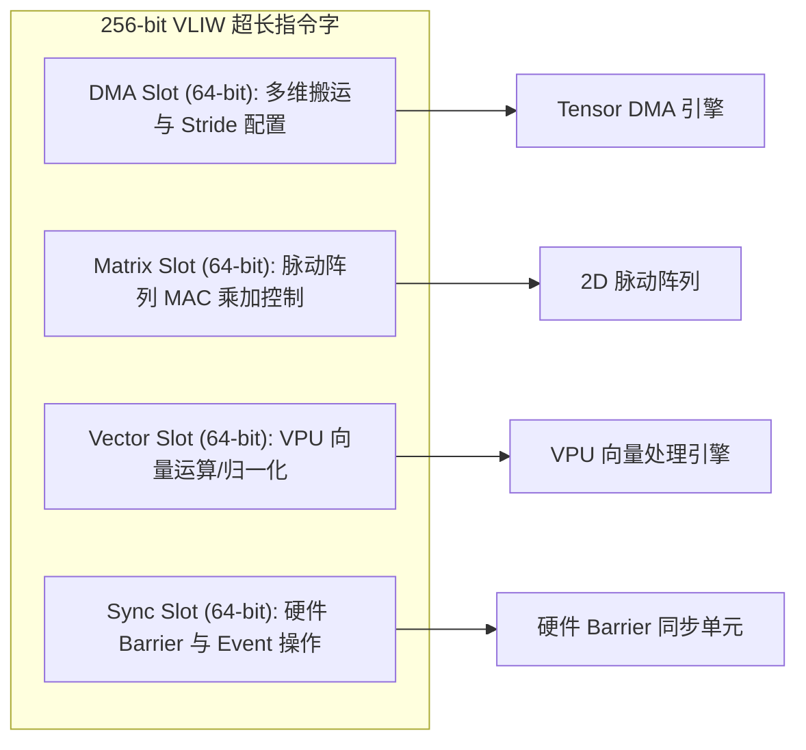

# 01 VLIW 超长指令字设计与多发射微架构

## 1. VLIW 256-bit 指令打包格式定义

为了消除动态乱序发射译码的面积与功耗开销，NPU 将指令并行性完全交由离线 AI 编译器确定：

```mermaid
graph LR
    subgraph VLIW_Word["256-bit VLIW 超长指令字"]
        Slot0["DMA Slot (64-bit): 多维搬运与 Stride 配置"]
        Slot1["Matrix Slot (64-bit): 脉动阵列 MAC 乘加控制"]
        Slot2["Vector Slot (64-bit): VPU 向量运算/归一化"]
        Slot3["Sync Slot (64-bit): 硬件 Barrier 与 Event 操作"]
    end

    Slot0 --> DMA_Unit["Tensor DMA 引擎"]
    Slot1 --> SA_Unit["2D 脉动阵列"]
    Slot2 --> VPU_Unit["VPU 向量处理引擎"]
    Slot3 --> Sync_Unit["硬件 Barrier 同步单元"]
```

- **单周期多发射**：NPU 指令译码器在 1 个时钟周期内将 4 个 Slot 分解下发至 4 个独立的物理引擎，实现硬件最高算力利用率。
