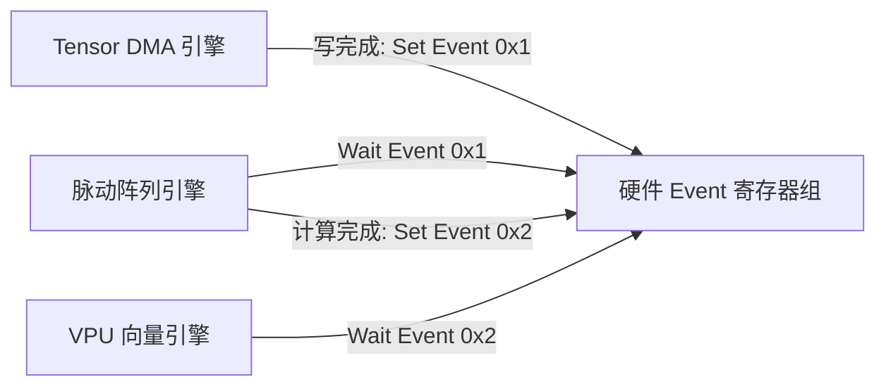

# 03 硬件 Barrier 同步栅障与 Event 寄存器

## 1. 跨引擎硬件同步机制

```mermaid
graph LR
    DMA["Tensor DMA 引擎"] -->|写完成: Set Event 0x1| EventReg["硬件 Event 寄存器组"]
    PE["脉动阵列引擎"] -->|Wait Event 0x1| EventReg
    PE -->|计算完成: Set Event 0x2| EventReg
    VPU["VPU 向量引擎"] -->|Wait Event 0x2| EventReg
```
