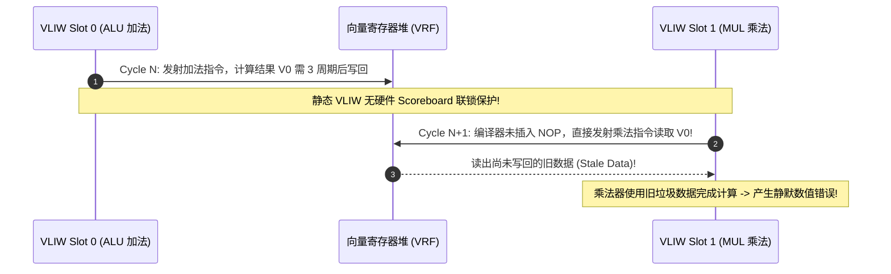
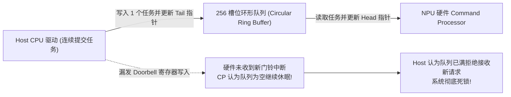

# 05 指令调度、VLIW 发射与硬件 Barrier 死锁调试实战

在专用 AI 加速器中，命令处理器（Command Processor / Task Scheduler）负责接收 Host 下发的微任务描述符，驱动 4~8 发射槽位的 VLIW 指令流，并通过硬件 Barrier / Event 寄存器协调矩阵、向量与 DMA 单元。深层故障涵盖**Event 编号混淆导致的乱序数据踩踏**、**VLIW 静态 RAW 冒险冲突**以及**环形指令队列（Ring Buffer）回绕漏单**。

---

## 案例 1：DMA 与 VPU 互锁 Event 标号冲突引发全局挂起

### 1. 现场故障现象与状态机死锁
在执行 Transformer 的 Softmax 与前馈网络（FFN）融合层时，整个 NPU Core 突然永久停顿。Host 端 Watchdog 在 3000ms 后告警。抓取 Command Processor（CP）与各执行引擎的硬件寄存器：

```text
[CP_DUMP] Task ID: 0x004A, PC: 0x0000_18C0, Instruction: VLIW_SLOT_SYNC
  VPU Engine Status: STALLED (Waiting for Event_ID = 0x03)
  DMA Engine Status: IDLE (Finished Task, Signal sent for Event_ID = 0x03 at cycle 840)
  Event Register 0x03 State: VALUE = 0 (Cleared prematurely!)
```

```mermaid
flowchart TD
    subgraph Event_Collision ["Event 0x03 冲突竞争"]
        Conv["前置残差加算子 (ResAdd)"] -->|提前完成, 发射 Signal(0x03)| EvtReg["硬件 Event 寄存器 (ID 0x03)"]
        EvtReg -->|被 ResAdd 算子误清零| VPU["VPU 向量引擎\n(正在等待 DMA 数据灌入的 Event 0x03)"]
        DMA["后置 Tensor DMA 引擎\n(实际承担 Event 0x03 的真实生产者)"] -->|正在搬运中, 尚未发射 Signal| Hanging["VPU 永久等待一个已被误清零的 Event!\n流水线全局 Hang 死!"]
    end
```

### 2. 根因剖析与寄存器重命名缺陷
- **硬件 Event 机制**：NPU 提供了 16 个硬件同步事件寄存器（`EVT_0` ~ `EVT_15`）。生产者完成时执行 `SIGNAL(id)`，消费者执行 `WAIT(id)` 并自动消费清除。
- **编译器缺陷**：AI 编译器后端的“全局寄存器分配与事件绑定 Pass”在处理控制流分支合并时，未能建立跨基本块（Basic Block）的 Event 活跃变量生命周期区间（Live-Range Interval）。编译器将上一个 ResAdd 算子的完成信号和后续 Tensor DMA 的权重就绪信号错误地分配给了同一个编号 `Event 0x03`。ResAdd 的提前执行将 Event 0x03 提前置位并被清零，导致真正的消费者 VPU 在等待 DMA 时永久阻塞。

### 3. 原厂修复与工程约束
1. **编译器 SSA 化生命周期检查**：
   重构编译器 Event 分配器，将硬件 Event 抽象为虚拟事件寄存器（Virtual Event），在进入机器码生成前实施图着色（Graph Coloring）分配算法，强制约束：两个并发活跃的异步依赖链严禁复用同一物理 Event ID。
2. **硬件超时防御（Event Wait Timeout Trap）**：
   在 CP 中加入硬件死锁看门狗：任何 `WAIT_EVENT` 指令若超过 $10^6$ 个时钟周期未收到 Signal，自动触发非屏蔽中断（NMI），保存当前现场上下文并向驱动上报精确的死锁指令 PC。

---

## 案例 2：VLIW 槽位间静态 RAW 冒险间隙不足导致静默算术错误

### 1. 现场故障现象
在纯向量（VPU）执行 LayerNorm 算子时，输出的均方差（Variance）出现间歇性随机毛刺（每次跑结果不同，偶发偏差超过 20%）：

```text
[MISMATCH] Step 12, Token 4:
  Golden Norm: 1.0428, Hardware Output: 0.1205 (Intermittent Bit Flip)
  SASS Code:
    Cycle N:   VPU.ADD  V0, V1, V2       ; Slot 0: 向量加法 (Latency = 3 cycles)
    Cycle N+1: VPU.MUL  V3, V0, V4       ; Slot 1: 紧接着读取 V0! (RAW Hazard!)
```



### 2. 根因剖析
- **DSA 极简无乱序设计理念**：为了极致压缩控制逻辑功耗与面积，许多 NPU 的 VPU 引擎彻底移除了动态流水线冒险检查器（Hardware Hazard Scoreboard / Interlocking），完全依赖**静态编译期软件流水编排（Static Software Scheduling）**保证依赖正确。
- **根因**：VPU 的向量加法指令到操作数旁路（Bypass Network）需要 3 个周期的流水线延迟。编译器代码生成器中对于浮点乘加（FMA）指令的延迟延迟表（Latency Table）被误配为 1 个周期，导致编译器未在两条指令之间插入 2 个 `NOP`（或调度其他无关指令填充），消费者提前读出了寄存器堆中的旧数据。

### 3. 根治方案
- **修正编译调度器机器模型**：更正编译器目标芯片 Target Architecture Description 文件，将 VPU 指令延迟矩阵（Instruction Latency Matrix）与硬件流水线级数 100% 对齐。
- **硬件 Scoreboard 兜底（可选模式）**：在芯片调试模式（Debug Mode）下，通过使能 `DBG_SCOREBOARD_EN` 寄存器，硬件会在发现 RAW 违规时强制暂停流水线并打印警告日志，便于在 Bring-up 阶段快速拦截编译器调度 Bug。

---

## 案例 3：Host 驱动 Doorbell 环形缓冲区指针回绕导致任务漏单

### 1. 现场故障现象与定位
在云端高并发推理服务中，当并发请求 QPS 突破 15,000 时，Host 侧报出 `npu_submit_task failed: Command Queue Full`，随后整个驱动卡死，硬件未执行后续任务：

```text
[DRIVER_ERR] Ring Buffer: Head=0x00FE, Tail=0x00FF (Size=256)
[HW_STATUS] NPU CP Status: State=IDLE, Current_Read_Ptr=0x00FE
[DIAGNOSIS] Doorbell dropped! HW CP stopped fetching because Tail caught up with Head.
```



### 2. 根因剖析
- Host 驱动与 NPU 之间通过共享内存中的环形队列（Circular Ring Buffer）传递任务。Host 更新 `Tail` 并向 PCIe MMIO `DOORBELL` 寄存器写入新尾指针；NPU CP 执行完毕后更新 `Head` 指针。
- **PCIe 弱内存序（Weak Ordering）重排**：Host CPU 驱动在将任务描述符写入 Host 内存后，未在写入 `DOORBELL` 寄存器之前插入 CPU 内存屏障（如 ARM `dmb osh` 或 x86 `sfence`）。导致写 PCIe Doorbell 的 MMIO 请求先于任务描述符内容到达，NPU CP 收到 Doorbell 立即读取 Ring Buffer，读到的却是无效的未初始化内存，判定描述符非法并停止推进。

### 3. 规避与修复措施
- **严格内存屏障约束**：
  ```c
  /* Linux 内核驱动修复代码 */
  ring_buffer[tail] = task_descriptor;
  dma_wmb(); /* 保证描述符数据 100% 刷入 DMA 可见内存 */
  writel_relaxed(tail, npu_dev->doorbell_reg); /* 触发硬件门铃 */
  ```
- **硬件双缓冲握手反馈**：在硬件 Doorbell 接口增加 Shadow Register 自动应答，杜绝指针竞态与回绕歧义。
