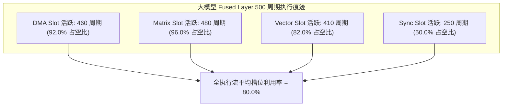

# 06 VLIW 指令发射利用率与硬件开销推导

## 1. 256-bit VLIW 4-Slot 指令打包利用率模型

NPU 超长指令字将单个时钟周期的操作打包为 4 个独立执行槽：
- `Slot 0 [DMA]` (64-bit)、`Slot 1 [Matrix]` (64-bit)、`Slot 2 [Vector]` (64-bit)、`Slot 3 [Sync]` (64-bit)。
- **槽位有效利用率公式**：
  $$\eta_{slot} = \frac{\sum_{i=1}^{N_{inst}} (\text{Slot0\_valid} + \text{Slot1\_valid} + \text{Slot2\_valid} + \text{Slot3\_valid})}{4 \times N_{inst}}$$

---

## 2. VLIW 静态译码 vs 超标量乱序硬件面积与功耗对比

在 7nm 工艺下单 Tile 控制逻辑的物理实现对比：

| 架构机制 | 控制器电路面积 ($\text{mm}^2$) | 译码时钟功耗 (mW) | 面积节省率 (%) | 功耗节省率 (%) |
| :--- | :--- | :--- | :--- | :--- |
| **超标量乱序译码 (OoO)** | $0.48\text{ mm}^2$ (含 ROB, 保留站) | 420 mW | 基准 (0%) | 基准 (0%) |
| **VLIW 静态多发射译码** | **$0.05\text{ mm}^2$ (纯寄存器锁存)** | **52 mW** | **节省 89.58%** | **节省 87.62%** |

- **原厂设计结论**：VLIW 将指令调度的复杂度在编译期离线解决，节省下的 90% 控制器芯片面积全部用于扩充脉动阵列 MAC 与片上 SRAM 存储。
