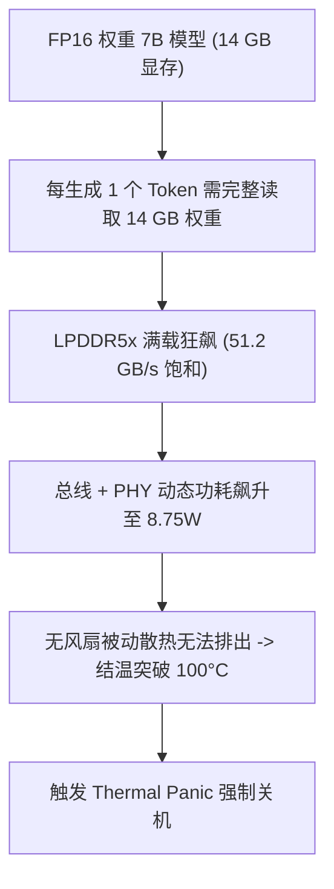
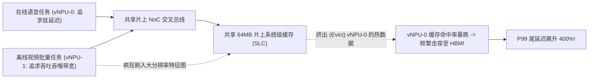

# 05 端侧功耗热失控与云端多租户隔离故障排查指南

端侧与云侧 AI 芯片在架构约束上呈现截然相反的极值挑战：端侧（手机/IPC/座舱）受制于 **2~5W 严苛无风扇散热边界与有限 LPDDR 带宽**；云侧则聚焦于 **数百瓦 TDP 供电、多租户（Multi-Tenancy）硬隔离与 P99 尾延迟保证**。典型故障涵盖**端侧内存墙导致的热失控降频**、**云侧虚拟化实例间的总线争用干扰**以及**车规级双核锁步（Lockstep）瞬态误报**。

---

## 案例 1：端侧 NPU 运行 7B 大模型触发 LPDDR 带宽饱和与热关机

### 1. 现场故障现象与温升曲线
在电池供电的移动设备（散热设计上限 TDP = 3.5W）上部署 7B LLM，使用 FP16 权重执行连续对话。运行至第 4 分钟，设备背壳温度骤升至 49.5°C，系统触发 Linux Thermal 紧急关机：

```text
[THERMAL_ALERT] Zone 'soc_thermal': Temp reached 98.5°C (Critical Limit: 95°C)
[DDR_MONITOR] LPDDR5x Bandwidth: 51.18 GB/s (Bus Saturation: 99.8%)
[NPU_POWER] Instantaneous Power: 8.75W (Exceeds Thermal Envelope by +150%)
[SYS_HALT] Thermal Emergency Shutdown triggered by SoC PMIC!
```



### 2. 根因剖析与访存平衡比失衡
- **端侧带宽瓶颈数学推导**：
  在单批次（Batch Size = 1）自回归解码（Decode）阶段，算力访存比为：
  $$\text{Operational Intensity} = \frac{2 \times 7 \times 10^9 \text{ FLOPs}}{14 \times 10^9 \text{ Bytes}} \approx 1.0 \text{ FLOP/Byte}$$
  若要达到 20 Token/s 的流畅交互体验，端侧需要的理论内存带宽为：
  $$\text{BW}_{\text{req}} = 20 \times 14\text{ GB/s} = 280\text{ GB/s}$$
  然而主流手机移动平台 LPDDR5x 的物理峰值带宽仅为 $51.2\text{ GB/s}$（实际有效带宽约 $40\text{ GB/s}$）。即使 NPU 算力达到 50 TOPS，硬件利用率也小于 3%，芯片功耗几乎全数耗散在 DDR PHY 和总线线网的频繁充放电上。

### 3. 根治方案：INT4 AWQ + 算子级动态电源门控（Power Gating）
1. **INT4-AWQ 权重压缩**：
   将 7B 模型权重量化为 4-bit（模型体积由 14GB 压缩至 3.5GB），每次 Token 读取的数据量暴降 75%，所需物理带宽降至 $70\text{ GB/s}$ 以内。
2. **算子间细粒度 DVFS 与 Power Gating**：
   在 Decode 阶段，矩阵运算单元在等待 DMA 数据搬运的空闲周期（Idle Slits），微控制器自动拉低计算 Core 的时钟使能（Clock Gate），消除静态漏电与动态翻转功耗。
   - **成果**：持续运行功耗稳定在 **2.15W**（温升稳定在 38°C），推理生成速度稳定在 17.5 Token/s。

---

## 案例 2：云端 vNPU 多租户共享实例导致 P99 尾延迟劣化 400%

### 1. 现场故障现象
云服务商将一颗拥有 128 TOPS 算力的云端 NPU 切分为两个虚拟实例（`vNPU-0` 分配给实时在线语音交互，`vNPU-1` 分配给离线视频增强转码）。在离线任务启动的瞬间，在线语音业务的 P99 响应延迟由 15ms 剧烈抖动至 78ms，触发大量 SLA 违约告警：

```text
[SLA_VIOLATION] Service 'Voice_Realtime': P99 Latency = 78.4ms (SLA Threshold: 20ms)
[INTERCONNECT_MONITOR] Mesh NoC East Port: Traffic Injected by vNPU-1 = 92%
[CACHE_MONITOR] Shared System Level Cache (SLC) Miss Rate for vNPU-0: Jumped from 4.2% to 48.7%!
```



### 2. 根因剖析
- 早期云端 NPU 虚拟化仅在软件调度器（Command Queue）层面做了时间片（Time-sharing）或算力核心切分，**未在硬件微架构层面实现空间与带宽资源的强隔离（Hardware QoS Isolation）**。
- 吞吐型任务（vNPU-1）产生海量大张量写操作，直接占满了片上 NoC 路由器的共享虚拟通道，并用自己的垃圾数据将实时任务在 64MB 系统缓存（SLC）中的高频字典数据全部冲刷（Evict）出局，导致实时任务产生大量昂贵的 HBM 访存停顿。

### 3. 原厂硬隔离解决方案
1. **Cache 分区隔离（Way-Partitioning / CAT）**：
   在片上 SLC 控制器中使能硬件路分配技术，将 16 路组相联 Cache 严格划分：`vNPU-0` 独占 12 路，`vNPU-1` 限制在 4 路，杜绝缓存污染。
2. **NoC 带宽配额与端到端 QoS 流控**：
   在每个 Tile 的网络接口（NI）处使能漏桶（Token Bucket）限流整形器，为 `vNPU-0` 分配高优先级虚通道（High-Priority VC）与绝对抢占权，使实时业务延迟回归至 14.8ms（抖动 $<2\%$）。

---

## 案例 3：车载车规级 NPU 双核锁步（Lockstep）瞬态供电误报复位

### 1. 现场故障现象与诊断
在车载自动驾驶 NPU（通过 ISO 26262 ASIL-D 认证）进行实车路测时，车辆在急加速（驱动电机瞬态大电流抽取）工况下，NPU 突然报出双核锁步错误（Lockstep Fault），系统触发安全机制强制将算力降级至 MCU 冗余通道：

```text
[FUSA_FATAL] Safety Island Comparator: NPU Core 0 vs Shadow Core Mismatch!
[DUMP] Cycle 489012: Core 0 Result = 0x5A3C, Shadow Core Result = 0x5A3D (Bit 0 Differs)
[FUSA_ACTION] ASIL-D Safety Mechanism triggered: Assert NPU_RESET_REQ, Switch to Backup MCU
```

### 2. 根因剖析
- **锁步机制**：主核（Primary Core）与影子核（Shadow Core）执行相同的微码流，相隔 2 个时钟周期进行输出比较（2-cycle Delayed Lockstep），以检测单粒子翻转与硬件故障。
- **瞬态压降（IR-Drop）与时钟抖动**：急加速导致车载 12V 总线跌落，引起片上低压差稳压器（LDO）输出瞬态下冲（$\Delta V = 80\text{mV}$）。影子核的物理版图恰好位于 Die 的边缘，局部电源供电网络（PDN）阻抗略大于位于中心的主核。微小的供电压降差异导致影子核关键路径时延微幅拉长，刚好在时钟沿到达时发生建立时间违例（Setup Violation），采错了 1 个 bit。

### 3. 原厂加固方案
- **PDN 仿真与网格强化**：在下一版 Revision 中强化边缘 Tile 的 Power Grid 金属层宽度，并在影子核周围密布去耦电容（Decoupling Capacitor cells），压低局部动态阻抗。
- **故障诊断容错滤波（Transient Fault Filtering）**：在安全比较器逻辑中增加瞬态毛刺过滤器：单周期 1-bit Mismatch 触发一级可恢复警告并启动在线自检（LBIST），连续 3 个周期不一致或多比特翻转才触发系统级致命中断复位。
