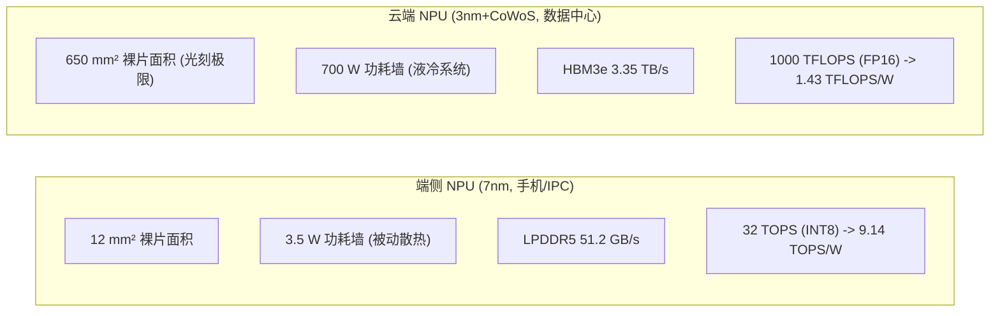

# 06 端侧与云端芯片 PPA 极限推导

## 1. 端侧 (Edge) vs 云端 (Cloud) NPU 核心指标全景对照

---

## 2. 算力与外部显存带宽平衡比 (Byte-to-Op Ratio) 定量推演

定义架构平衡常数：$R_{b/op} = \frac{\text{Memory Bandwidth (Bytes/s)}}{\text{Peak Compute (Ops/s)}}$：
- **端侧 NPU**：
  $$R_{b/op\_edge} = \frac{51.2 \times 10^9\text{ Bytes/s}}{32 \times 10^{12}\text{ Ops/s}} = \mathbf{0.0016\text{ Bytes/Op (1.6 B/KOp)}}$$
- **云端 NPU**：
  $$R_{b/op\_cloud} = \frac{3.35 \times 10^{12}\text{ Bytes/s}}{1000 \times 10^{12}\text{ FLOPs/s}} = \mathbf{0.00335\text{ Bytes/FLOP (3.35 B/KOp)}}$$

### 架构设计指导准则：
- 云端 NPU 的 Byte-to-Op 比值是端侧的 2.1 倍，更适合承载参数量超大的大模型训练；
- 端侧 NPU 外部带宽极度匮乏，模型部署必须强制执行 **INT4/INT8 极限权重量化与卷积层间极致算子融合**，将数据完全闭环在片上 2MB SRAM 内。
