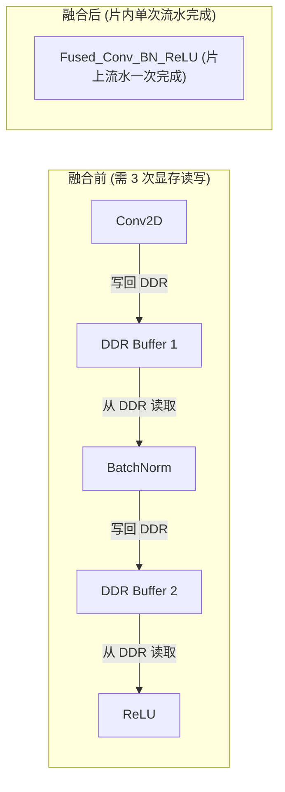

# 01 计算图优化与算子融合 (Graph Optimization & Fusion)

## 1. 经典算子融合模式 (Operator Fusion)

算子融合是减少 DDR/HBM 访存次数、提升算力利用率的关键手段：
- **Conv + BatchNorm + ReLU 融合**：在编译期将 BatchNorm 参数直接数学折叠进卷积权重 $W$ 与偏置 $B$ 中，并在脉动阵列输出端由激活单元直接完成 ReLU，消除两次中间显存写回。
- **MatMul + Bias + GELU 融合**：矩阵乘计算结果在片内流水线直接加上 Bias 并执行 GELU 激活函数。

