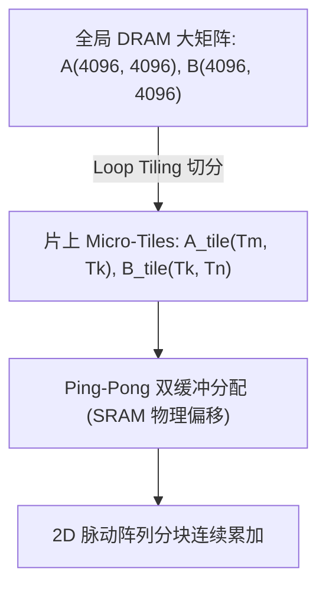
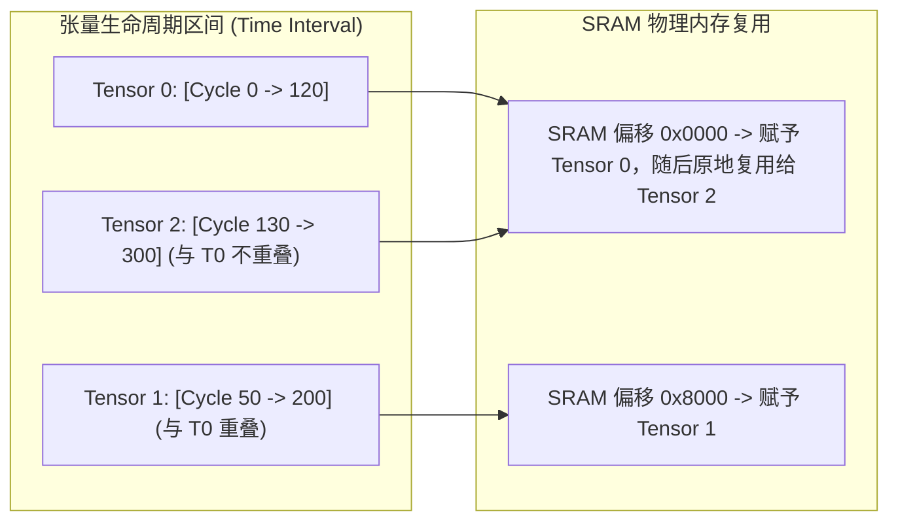

# 02 Tiling 切分策略与静态 SRAM 内存复用规划

## 1. 多级循环切块 (Loop Tiling) 空间约束模型

对于大矩阵乘法 $C(M, N) = A(M, K) \times B(K, N)$，设片上 Scratchpad SRAM 总容量为 $C_{SRAM}$（如 2MB）：

### 1. 双缓冲容量不等式
$$\text{Memory Required} = 2 \times (T_m \times T_k + T_k \times T_n + T_m \times T_n) \times \text{Bytes\_per\_Elem} \le C_{SRAM}$$

### 2. 算力与搬运平衡约束方程
为了实现完全无气泡重叠，Tile 切分必须满足：
$$T_{DMA}(T_m, T_n, T_k) \le T_{Compute}(T_m, T_n, T_k)$$
$$\frac{(T_m \times T_k + T_k \times T_n) \times \text{Bytes\_per\_Elem}}{\text{DRAM Bandwidth}} \le \frac{2 \times T_m \times T_n \times T_k}{\text{Array Peak FLOPS}}$$

---

## 2. 静态内存区间图着色算法 (Interval Graph Coloring)

通过在编译期执行区间图着色，NPU 软件栈实现了 **100% 静态分配与 0 内存碎片**，消除了任何运行期 `malloc`/`free` 开销。
