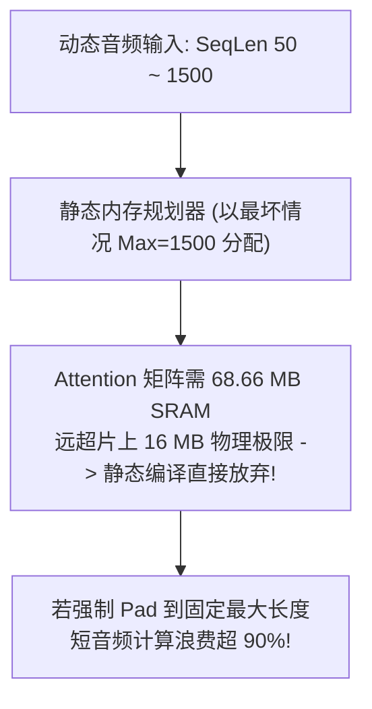
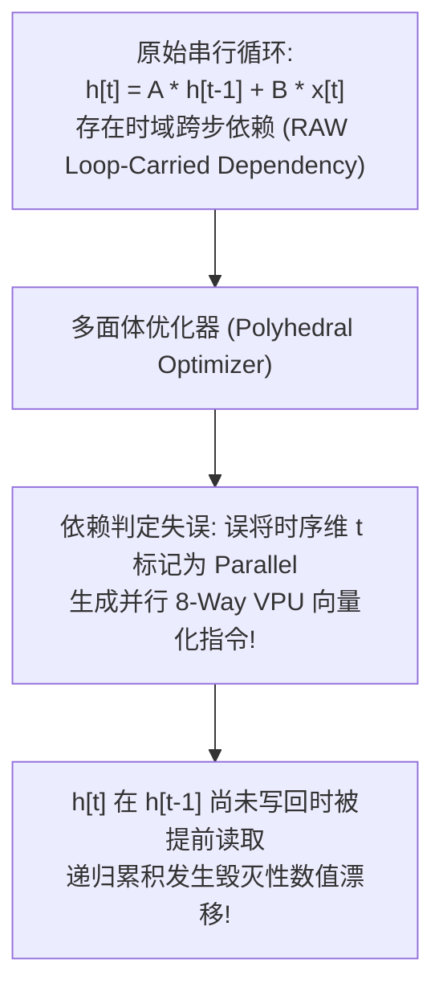

# 05 编译期静态图优化、Tiling 与内存规划故障排查指南

AI 专用编译器（如基于 MLIR/TVM 深度定制的原厂编译器）核心职责是将计算图离线编译为硬件原生 VLIW 控制流与静态内存排布。深层工程问题包括**动态输入尺寸击穿静态片上内存规划**、**多层循环变换（Loop Tiling/Slicing）依赖误判**以及**算子融合模式匹配断裂引发的访存雪崩**。

---

## 案例 1：动态 Sequence Length 击穿编译期静态内存规划

### 1. 现场故障现象与编译报错
在部署基于 Transformer 的语音识别（ASR）模型时，由于输入音频时长在 $0.5\text{s} \sim 15.0\text{s}$（对应序列长度 $\text{SeqLen} \in [50, 1500]$）剧烈动态波动，离线编译器抛出内存规划致命错误并中断编译：

```text
[COMPILER_FATAL] pass: StaticMemoryPlanner
  Error: SRAM Buffer Allocation Failure at Op: 'encoder.layer_11.attention.score'
  Requested Tensor Size: [1, 16, 1500, 1500] * FP16 = 72,000,000 Bytes (68.66 MB)
  Hardware Constraint: On-Chip Scratchpad Capacity = 16.00 MB
  StaticMemoryPlanner: Failed to find valid non-overlapping offset within SRAM boundary!
```



### 2. 根因剖析与架构权衡
- **DSA 专用加速器的静态设计原则**：为了消除运行时动态内存分配（`malloc`/`free`）带来的不确定性时延与碎块（Fragmentation），NPU 体系架构通常要求所有张量在编译期完成确定性基地址绑定。
- **最坏情况假设陷阱**：若直接采用全局最大输入尺寸（Upper Bound）进行静态分配，中间 Attention 特征图体积随 $\text{SeqLen}^2$ 呈二次方爆炸，瞬间击穿 SRAM 上限；而若一律退化为全局 DDR 内存搬运，又会导致推理性能暴跌 80%。

### 3. 原厂根治方案：分档多 Bucket 编译 + 动态 Slice 流水线
1. **多档位 Bucket 编译机制**：
   编译器自动根据输入历史分布切分档位：`Bucket_0: 128`、`Bucket_1: 512`、`Bucket_2: 1536`。离线为各档位生成专属静态规划微码包。运行期驱动根据真实输入长度快速匹配最小档位，将片上 SRAM 浪费降至最低。
2. **FlashAttention 式分块 Tiling（Block-wise Computation）**：
   在计算图中引入分块算子：即使外部序列长达 1500，编译期强制将 $Q, K, V$ 切分成 $64 \times 64$ 的物理 Tile，在片上 SRAM 中仅保留当前子块并以在线增量归约（Online Softmax）方式推进，将 SRAM 占用从 $O(N^2)$ 严格压缩至 $O(N \times B_{\text{tile}})$，彻底消除超限 OOM。

---

## 案例 2：多层循环变换依赖失效导致前向 RAW 依赖被非法向量化

### 1. 现场故障现象与数值发散
在对含有递归门控循环单元（如 Mamba / State Space Model 或 RNNCell）的算子实施 Polyhedral 循环优化后，模型输出在首个 Step 正常，但随后步数数值呈指数级发散至 `NaN`：

```text
[STEP 0] Golden: 0.8142, Actual: 0.8142 (Exact match)
[STEP 1] Golden: 1.1205, Actual: 0.0000 (Mismatch!)
[STEP 2] Golden: 1.4502, Actual: -489.12 (Divergence!)
[STEP 3] Golden: 1.9801, Actual: NaN
```



### 2. 根因剖析
- 循环优化器利用多面体模型（Polyhedral Model）对嵌套循环进行重排序（Loop Interchange / Skewing / Parallelization）。
- **指针别名（Aliasing）判定缺陷**：在算子底层实现中，隐藏状态张量 `h_prev` 与 `h_next` 在外层 Python 封装中被包装成两个不同名字的 Tensor，但底层的内存描述符（Buffer Sub-view）指向了同一块连续的物理内存。编译器前端未正确标注 `Restrict` 别名属性，导致优化 Pass 误认为循环迭代之间互不依赖（Independence），非法生成了跨迭代并行向量化指令。

### 3. 根治与编译器防御约束
- **强制依赖距离向量（Dependence Distance Vector）检查**：
  在应用任何并行变换前，优化器必须对所有内存读写引用构建严格的多面体约束不等式系统：
  $$\vec{D} = \vec{I}_{\text{sink}} - \vec{I}_{\text{source}} \ge \vec{0}$$
  若存在任意 $\vec{D} \ne \vec{0}$（跨迭代依赖），严禁对该维度实施并行展开，强制降级为流水线排步（Software Pipelining）或时域对角线倾斜（Skewing）。

---

## 案例 3：算子融合模式匹配断裂引发 DDR 访存雪崩与性能暴跌

### 1. 现场故障现象
在将视觉 Transformer（ViT）模型迁移至新版本 AI 编译器时，端到端推理时延由 8.2ms 暴增至 28.5ms（性能劣变为原先的 $35\%$），通过硬件 Profiler 抓取 DDR 带宽占用：

```text
[PROFILE] Compiler v1.2: DDR Read/Write Total = 184 MB / Frame (Exec: 8.2ms)
[PROFILE] Compiler v2.0: DDR Read/Write Total = 890 MB / Frame (Exec: 28.5ms)
[GRAPH_DIFF] Node 'encoder.layer.0':
  v1.2: FusedOp_Conv_Bias_GELU_ResAdd (Executed entirely within SRAM)
  v2.0: Conv -> DDR_Write -> DDR_Read -> BiasAdd -> DDR_Write -> DDR_Read -> GELU ...
```


### 2. 根因剖析
- **模式匹配（Pattern Matching）断裂**：编译器 v2.0 升级了计算图类型推导 Pass，将 GELU 内部的浮点常量系数自动提升为 `TensorConstant<FP32>`，而旧版的算子融合规则定义（DRR Rule）要求系数为标量属性 `Attribute<Float>`。
- **融合失败退化**：类型签名不匹配导致融合重写规则直接脱靶，原本可在张量计算核心与 VPU 片上流水线（On-the-fly）完成的简单逐元素（Element-wise）操作，退化为 4 个独立算子，被迫将海量中间特征图通过 Tensor DMA 反复进出外部 DDR，导致执行时间被内存带宽彻底锁死。

### 3. 规避与防护工程机制
- **声明式融合规则宽松匹配**：在 MLIR Pattern Rewriter 中采用基于数据流拓扑（Def-Use Chain）的语义图匹配，解耦数据类型硬性限制；
- **编译期访存预算熔断（Memory Traffic Budget Gatekeeper）**：
  在 CI/CD 自动化回归测试中增加守门规则：若某个图优化 Pass 导致的 DDR 吞吐量相比 Baseline 上浮超过 $5\%$，自动阻断构建并发出警报。
