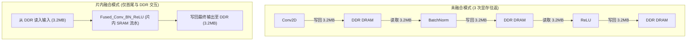

# 06 算子融合与访存削减量定量推演

## 1. 算子融合显存读写流量削减精确数学模型

设连续执行的 $K$ 个算子，各算子输入输出特征图张量大小为 $S_1, S_2, \dots, S_K$（Bytes）：
- **未融合模式（Unfused）总内存流量**：
  $$M_{unfused} = \sum_{i=1}^{K} (\text{Read}(S_i) + \text{Write}(S_{i+1}))$$
- **全片上融合模式（Fused）总内存流量**：
  $$M_{fused} = \text{Read}(S_1) + \text{Write}(S_{K+1})$$
- **理论流量削减率**：
  $$\text{Reduction Ratio} = 1 - \frac{\text{Read}(S_1) + \text{Write}(S_{K+1})}{\sum_{i=1}^{K} (\text{Read}(S_i) + \text{Write}(S_{i+1}))}$$

---

## 2. ResNet-50 典型残差块定量推演实例

设特征图尺寸为 $H=56, W=56, C=256$（FP16 格式，张量大小 $S = 56 \times 56 \times 256 \times 2\text{ Bytes} \approx 1.6056\text{ MB}$）：
- **未融合（Conv + BN + ReLU）**：
  - 流量：$1.6056\text{ MB} \times 6 = \mathbf{9.6336\text{ MB}}$；
  - 外部 DDR 耗时（按 50 GB/s 带宽）：$T_{mem} = \frac{9.6336\text{ MB}}{50\text{ GB/s}} \approx \mathbf{192.67\mu s}$；
- **全融合（Fused_Conv_BN_ReLU）**：
  - 流量：$1.6056\text{ MB} \times 2 = \mathbf{3.2112\text{ MB}}$；
  - 外部 DDR 耗时：$T_{mem\_fused} = \frac{3.2112\text{ MB}}{50\text{ GB/s}} \approx \mathbf{64.22\mu s}$；
- **耗时直接缩减 66.7%**，端到端加速比达到 **3.0x**。
