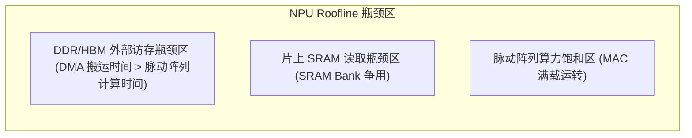

# 02 NPU Roofline 模型与 Memory vs Compute-Bound 诊断

## 1. NPU 专属 Roofline 曲线

```mermaid
graph LR
    subgraph NPURoofline["NPU Roofline 瓶颈区"]
        Mem["DDR/HBM 外部访存瓶颈区 (DMA 搬运时间 > 脉动阵列计算时间)"]
        SRAM_Bandwidth["片上 SRAM 读取瓶颈区 (SRAM Bank 争用)"]
        Compute["脉动阵列算力饱和区 (MAC 满载运转)"]
    end
```
