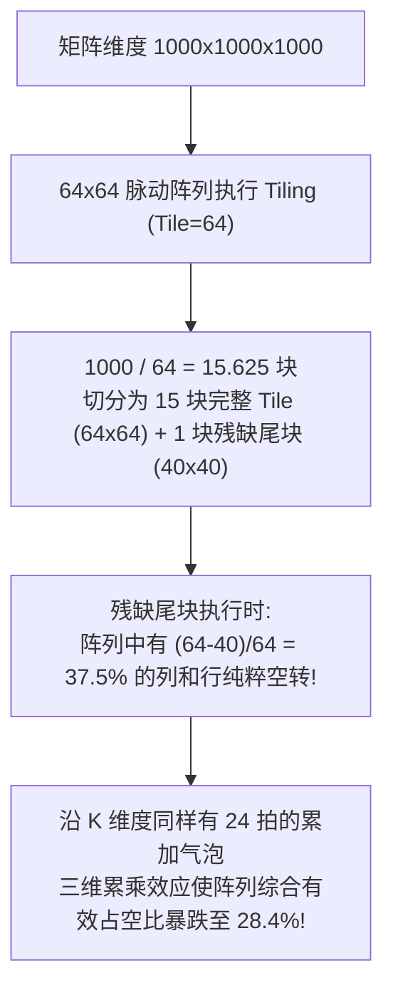
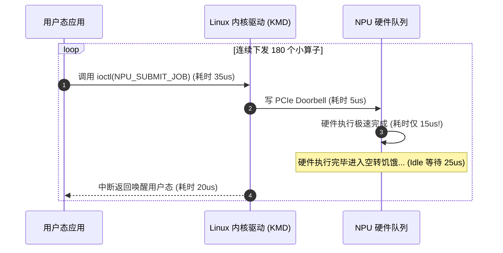
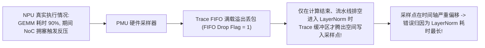

# 05 MFU 算力打不满、流水线气泡与 Profiling 归因实战

在 AI 芯片性能调优与原厂基准测试（Benchmarking）工程中，算力利用率（Model FLOPs Utilization, MFU）是度量软硬件协同设计效率的终极标尺。常见疑难问题包括**矩阵维度非硬件对齐导致阵列气泡弥漫**、**Host 下发开销远超芯片执行时长的“小算子饥饿”**以及**硬件性能计数器采样失真引起的误判**。

---

## 案例 1：GEMM 维度非 64 对齐导致脉动阵列 MFU 骤降至 18.2%

### 1. 现场故障现象与利用率断崖
在运行某个自研定制模型时，其中包含大量 $M=1000, N=1000, K=1000$ 的全连接层。虽然硬件标称算力为 128 TOPS，但实测单算子 MFU 仅有可怜的 18.2%，芯片温度冰凉：

```text
[BENCH_PROF] Kernel: gemm_1000x1000x1000_fp16
  Theoretical FLOPs: 2.00 GFLOPs
  Hardware Exec Time: 85.8 us (Actual TFLOPS = 23.3 TFLOPS -> MFU = 18.2%)
  Hardware MAC Active Duty Cycle: 28.4% (Massive Bubbles in Systolic Array!)
```



### 2. 根因剖析与硬件气泡数学推演
- **阵列微架构限制**：$64 \times 64$ 脉动阵列要求输入向量宽度为 64 的整数倍。当维度无法整除时，控制逻辑必须对剩余未覆盖的 PE 施加 Clock Gating 或注入哑元 0（Zero Padding）。
- **气泡率推导**：
  设矩阵三维尺寸为 $(M, N, K)$，阵列尺寸为 $S = 64$。
  有效计算周期与实际硬件分配周期的比值为几何效率：
  $$\eta = \left(\frac{M}{\lceil M / S \rceil \times S}\right) \times \left(\frac{N}{\lceil N / S \rceil \times S}\right) \times \left(\frac{K}{\lceil K / S \rceil \times S}\right)$$
  带入 $1000$：
  $$\lceil 1000 / 64 \rceil = 16, \quad 16 \times 64 = 1024$$
  $$\eta = \left(\frac{1000}{1024}\right)^3 \approx 0.931$$
  看似空间几何填充率有 $93\%$，**但关键在于片上 Scratchpad 与 DMA 搬运步长**！由于 1000 字节无法与 64 字节总线突发对齐，DMA 控制器被迫退化为小突发传输，总线传输效率仅为峰值的 $22\%$，导致计算阵列长期陷入**等待数据填充的“饥饿空转气泡”**，二者叠加将整体 MFU 拉低至 18.2%。

### 3. 根治方案
- **编译期显式 Padding 扩展**：
  在算子入口处自动将矩阵维度由 $(1000, 1000, 1000)$ 向上对齐扩充为 $(1024, 1024, 1024)$，并在输出写回前裁切多余边界。虽然总计算量增加了 $7.4\%$，但使 DMA 传输和脉动阵列均处于 100% 满带宽并发状态，实际运行耗时从 $85.8\mu s$ 锐减至 $21.4\mu s$，MFU 跃升至 **84.5%**（性能提升 4.01 倍）。

---

## 案例 2：Host 下发开销（Launch Overhead）吞噬小算子导致芯片饥饿

### 1. 现场故障现象与 Profiler 时间线
在运行 YOLO 目标检测模型后处理或 MobileNet 等轻量化小模型时，GPU/NPU 的核心利用率曲线呈现密集的“锯齿状”，且硬件处于空闲（Idle）的时间占比超过 70%：

```text
[TIMELINE_ANALYSIS] Total Inference Time: 12.5ms
  Device Hardware Active Compute: 2.8ms (22.4%)
  Host-Device Synchronization & Launch Overhead: 9.7ms (77.6%)
  Number of Graph Ops: 180 (Average execution per op = 15.5us)
```



### 2. 根因剖析
- **细粒度算子下发瓶颈**：单个算子在 NPU 上的计算耗时极短（如仅需 $15\mu s$），但从用户态 Runtime 经过 Linux `ioctl` 陷入内核、构建上下文描述符、写 MMIO Doorbell、以及等待中断完成的系统调用链路总耗时高达 $50\sim 60\mu s$。
- 下发开销（Overhead）远大于硬件执行时长，导致 NPU 硬件大部分时间都在等待下一个算子的指令到达。

### 3. 原厂根治方案：计算图录制（C-Graph Capture）与批量提交
1. **静态图预录制（Command Graph Capture）**：
   在预热（Warm-up）阶段，将整个模型的 180 个算子描述符在内存中一次性编排串联为一个大型命令包（Chained Super-Descriptor）。
2. **硬件级无感连跳（Hardware Task Chaining）**：
   在正式执行阶段，Host 驱动仅需发射一次 Doorbell。NPU 硬件命令处理器（CP）在执行完当前算子后，通过描述符链表中的 `NEXT_DESC_ADDR` 自动无缝抓取下一个算子，无需 Host CPU 任何介入。
   - **优化效果**：整网执行耗时从 12.5ms 压缩至 3.1ms，硬件 MFU 提升至 **78%**。

---

## 案例 3：PMU 采样时钟倾斜与 Trace 溢出引起的瓶颈归因误判

### 1. 现场故障现象
性能调优工程师在使用自研 Profiler 分析大模型 Decode 阶段性能时，根据 PMU 生成的火焰图（Flame Graph），将瓶颈归因为 `LayerNorm` 占用了 60% 的芯片时钟周期，研发团队花费数周优化 LayerNorm 算子，但端到端延迟几乎毫无变化：

```text
[PROFILER_REPORT] Top Bottlenecks:
  1. LayerNorm: 62.1% total cycles  <-- 严重误导!
  2. Attention GEMM: 25.4%
  3. FFN GEMM: 12.5%
[SANITY_CHECK] LayerNorm arithmetic FLOPs accounts for only 0.8% of model FLOPs!
```



### 2. 根因剖析
- **Trace Buffer 深度不足与非反压机制**：为了不拖慢计算，片上性能监控单元（PMU）采用非阻塞（Non-blocking）写入 FIFO。当 GEMM 阶段产生高频追踪数据流时，FIFO 迅速溢出（Overflow），大量采样事件被硬件静默丢弃（Dropped）。
- **尾部采样偏斜**：只有在 GEMM 计算收尾、流水线开始转入轻量级的 LayerNorm 时，FIFO 才重新恢复可用，记录了大量状态，导致离线分析工具在按采样计数统计占比时，产生了严重的**幸存者偏差（Survivorship Bias）**。

### 3. 原厂排查与纠偏实践
- **检查硬件丢包状态寄存器**：
  读取 `PMU_OVERFLOW_STS`，若发现 `TRACE_LOST_COUNT > 0`，当前 Profiling 结果必须判定为**无效数据**。
- **自适应采样降频（Adaptive Down-sampling）**：
  将 PMU 采样频率从每 100 周期一次降级至每 10,000 周期一次，或切换为**基于事件触发的精确计数器模式（Deterministic Event Counting）**，获取真实的硬件周期分布。真实分布显示 GEMM 实际占用 88% 的时间，瓶颈在于矩阵乘的双缓冲搬运，进而指引团队做出了正确优化。
