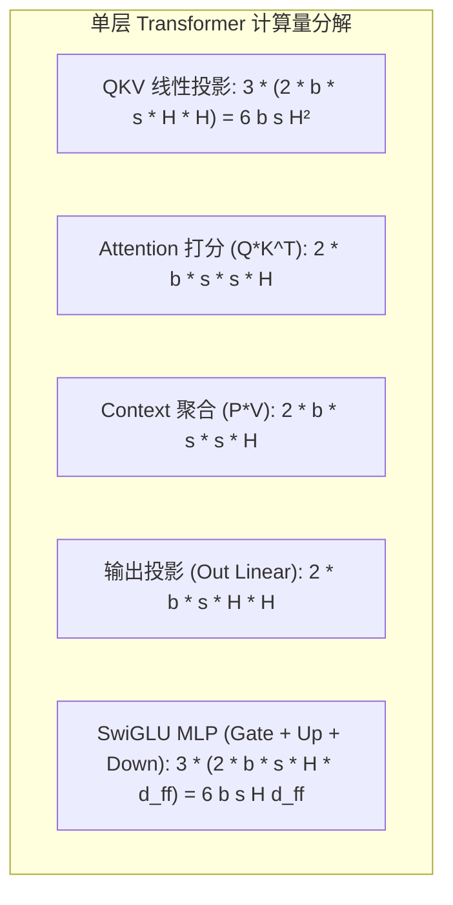

# 06 NPU MFU 与 HFU 理论推导与评测

## 1. Transformer 单层前向与反向理论计算量推导

对于标准 Transformer 解码层（隐藏维度 $H$，中间层维度 $d_{ff} = 4H$，注意力头数 $n_h$，序列长度 $s$，Batch 大小 $b$）：

### 闭式计算公式：
$$\text{FLOPs}_{forward} = 8 b s H^2 + 4 b s^2 H + 6 b s H d_{ff}$$
$$\text{FLOPs}_{backward} \approx 2 \times \text{FLOPs}_{forward} \implies \text{FLOPs}_{step} = 3 \times \text{FLOPs}_{forward}$$

---

## 2. LLaMA-7B 真实训练 MFU 实例定量计算

- **模型参数**：$H = 4096, d_{ff} = 11008, N_{layers} = 32$；
- **批次配置**：$b = 4, s = 2048$；
- **单层前向计算量**：
  $$\begin{aligned}
  \text{FLOPs}_{fwd\_layer} &= 8(4)(2048)(4096^2) + 4(4)(2048^2)(4096) + 6(4)(2048)(4096)(11008) \\
  &= 1.0995 \times 10^{12} + 0.2749 \times 10^{12} + 2.2163 \times 10^{12} \\
  &= \mathbf{3.5907\text{ TFLOPs}}
  \end{aligned}$$
- **全模型单步训练总计算量 (Forward + Backward)**：
  $$\text{FLOPs}_{total\_step} = 32 \times 3 \times 3.5907\text{ TFLOPs} = \mathbf{344.707\text{ TFLOPs}}$$
- **评测环境**：8-NPU 节点，单卡峰值算力 200 TFLOPS（节点总峰值 1600 TFLOPS），实测单步迭代耗时 $T_{step} = 0.285\text{ s}$：
  $$\text{MFU} = \frac{344.707 \times 10^{12}\text{ FLOPs}}{1600 \times 10^{12}\text{ FLOPs/s} \times 0.285\text{ s}} = \frac{344.707}{456.0} = \mathbf{75.59\%}$$
- **结论**：硬件算力利用率突破 75%，达到工业界顶级优化水准。
