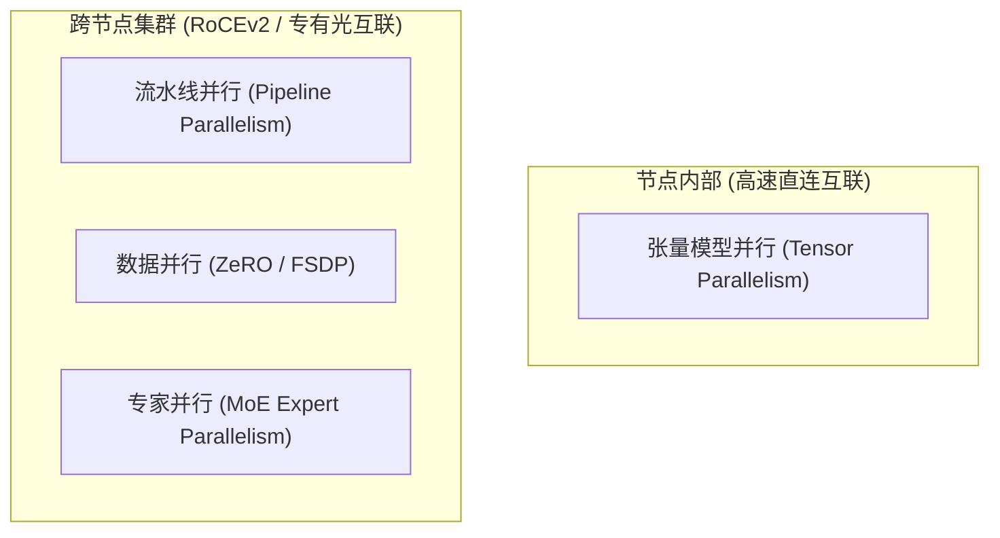

# 03 超大模型在多 NPU 集群上的并行映射

## 1. 大模型分布式训练与推理映射策略

```mermaid
graph TD
    subgraph IntraServer["节点内部 (高速直连互联)"]
        TP["张量模型并行 (Tensor Parallelism)"]
    end

    subgraph InterServer["跨节点集群 (RoCEv2 / 专有光互联)"]
        PP["流水线并行 (Pipeline Parallelism)"]
        DP["数据并行 (ZeRO / FSDP)"]
        EP["专家并行 (MoE Expert Parallelism)"]
    end
```
